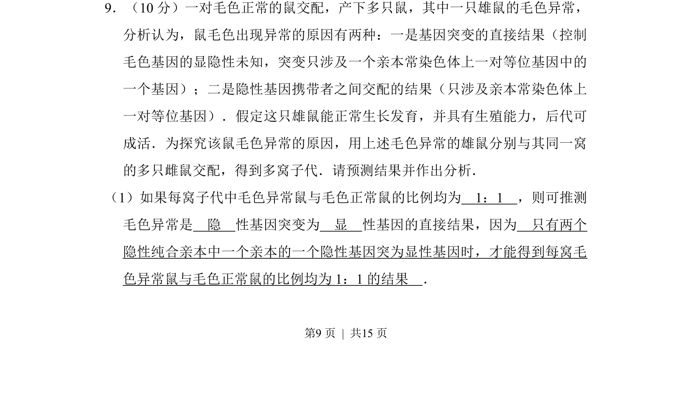
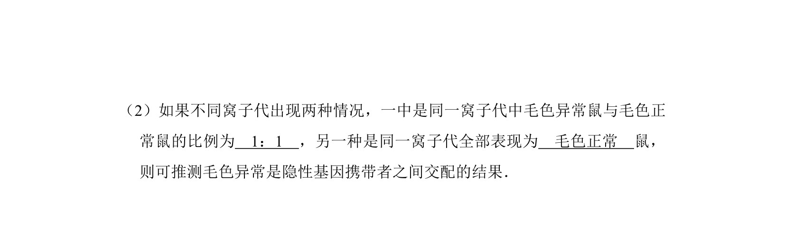
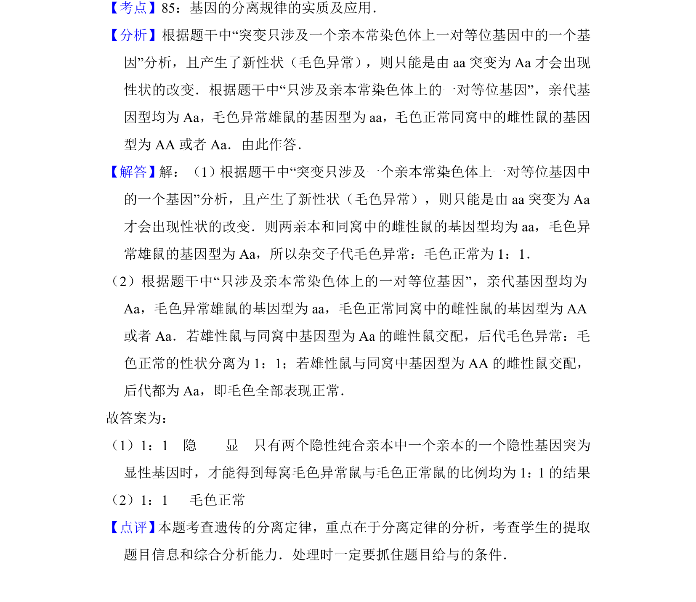

## 题面

## 摘要

探究鼠毛色异常原因，通过杂交实验推断基因突变或隐性遗传。

## 关联考点

- [[301-基因突变|基因突变]]
- [[891-显隐性关系|显隐性关系]]
- [[266-分离定律|分离定律]]
- [[482-实验设计|实验设计]]

## 答案与解析

> 📄 原 PDF 第 9 页：`素材/真题/湖南/2008-2024·（湖南）生物高考真题/2012年高考生物试卷（新课标）（解析卷）.pdf`
