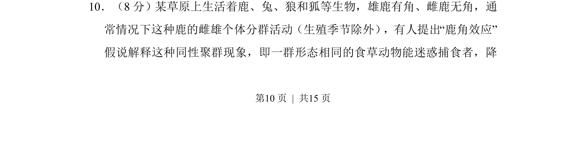
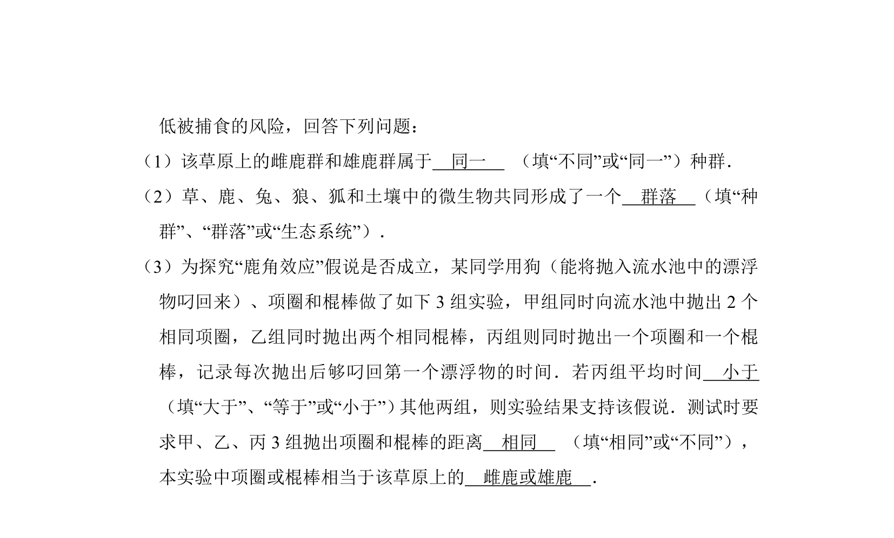
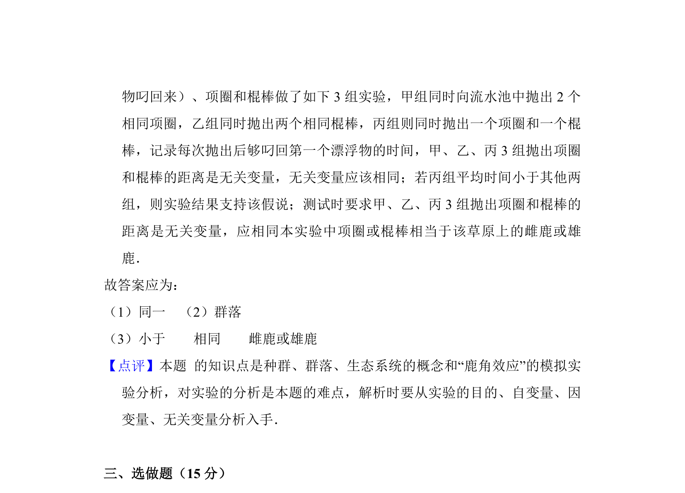

## 题面

## 摘要

该题通过“鹿角效应”假说情境，考查生态系统中种间关系与动物行为适应。

## 关联考点

- [[022-生物因素|种间关系]]
- [[406-捕食|捕食关系]]
- [[行为适应]]
- [[501-生态位|生态位]]

## 答案与解析

> 📄 原 PDF 第 10 页：`素材/真题/湖南/2008-2024·（湖南）生物高考真题/2012年高考生物试卷（新课标）（解析卷）.pdf`
