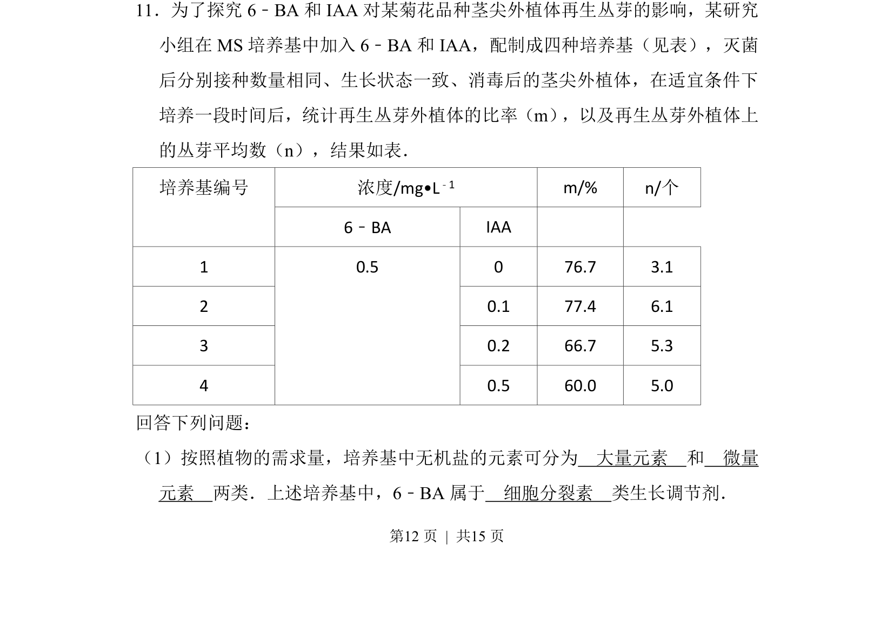
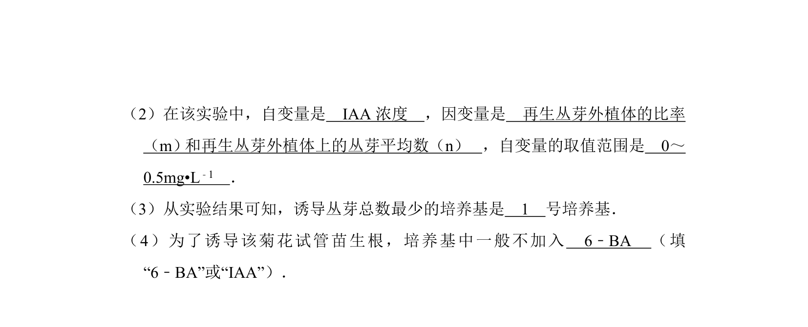
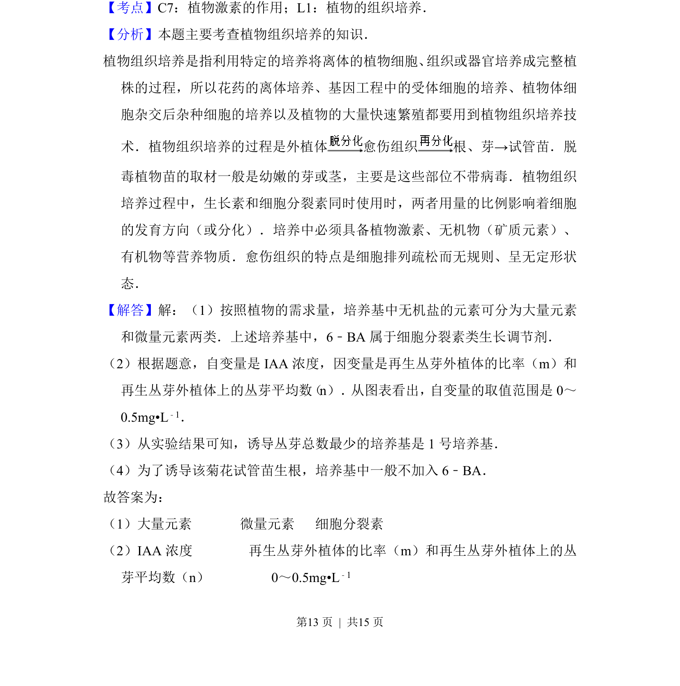
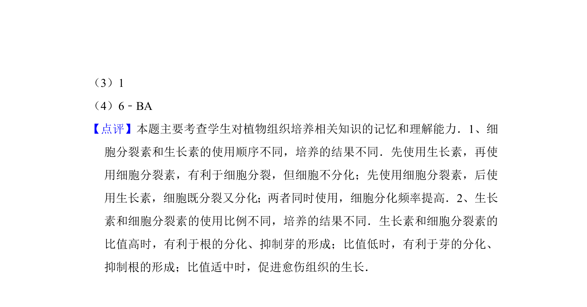

## 题面

## 摘要

本题以菊花茎尖外植体再生丛芽实验为背景，考查植物组织培养中培养基成分的分类及植物生长调节剂的识别。

## 关联考点

- [[437-植物组织培养|植物组织培养]]
- [[大量元素和微量元素]]
- [[495-植物生长调节剂|植物生长调节剂]]
- [[349-细胞分裂素|细胞分裂素]]

## 答案与解析

> 📄 原 PDF 第 12 页：`素材/真题/湖南/2008-2024·（湖南）生物高考真题/2012年高考生物试卷（新课标）（解析卷）.pdf`
