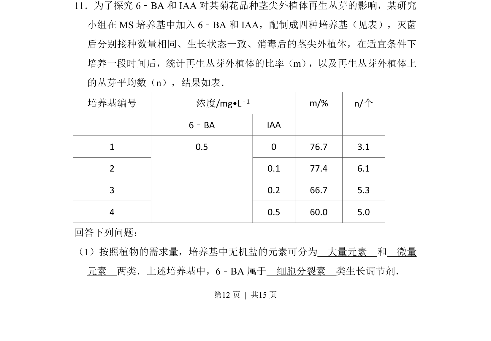
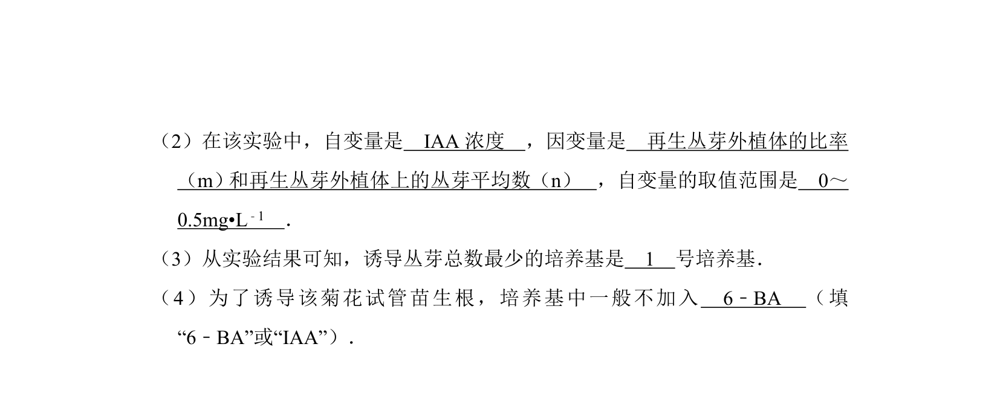
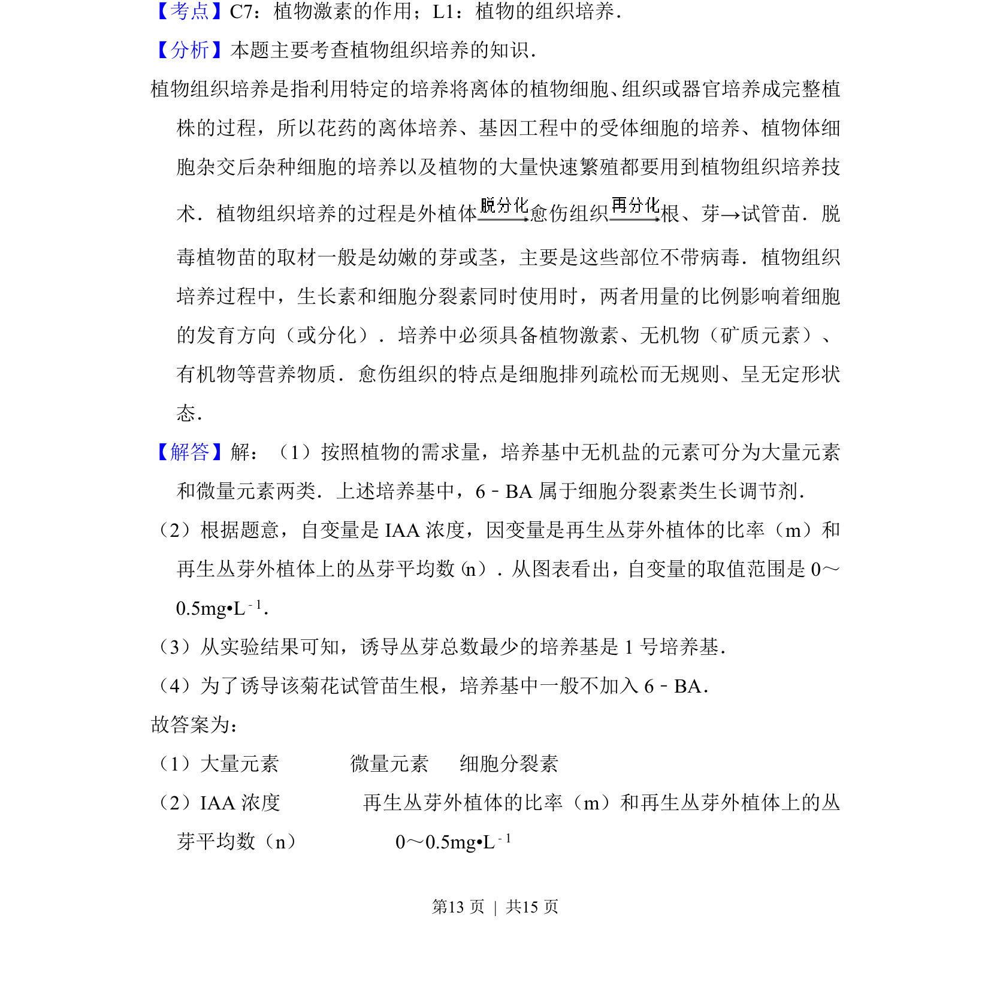
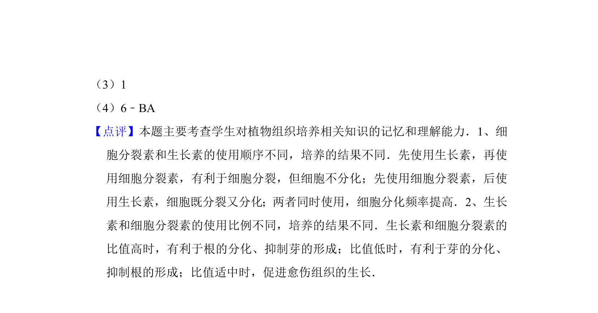

## 题面

## 摘要

本题以菊花茎尖外植体再生丛芽实验为背景，考查植物组织培养中培养基成分的分类及植物生长调节剂的识别。

## 关联考点

- [[437-植物组织培养|植物组织培养]]
- [[大量元素和微量元素]]
- [[495-植物生长调节剂|植物生长调节剂]]
- [[349-细胞分裂素|细胞分裂素]]

## 答案与解析

> 📄 原 PDF 第 12 页：`素材/真题/湖南/2008-2024·（湖南）生物高考真题/2012年高考生物试卷（新课标）（解析卷）.pdf`

<!-- 题干文本-start -->
## 题干文本
11．为了探究6﹣BA和IAA对某菊花品种茎尖外植体再生丛芽的影响，某研究
小组在MS培养基中加入6﹣BA和IAA，配制成四种培养基（见表），灭菌
后分别接种数量相同、生长状态一致、消毒后的茎尖外植体，在适宜条件下
培养一段时间后，统计再生丛芽外植体的比率（m） ，以及再生丛芽外植体上
的丛芽平均数（n），结果如表．
浓度/mg•L﹣1 m/% n/个培养基编号
6﹣BA IAA
1 0 76.7 3.1
2 0.1 77.4 6.1
3 0.2 66.7 5.3
4
0.5
0.5 60.0 5.0
回答下列问题：
（1）按照植物的需求量，培养基中无机盐的元素可分为　大量元素　和　微量
元素　两类．上述培养基中，6﹣BA属于　细胞分裂素　类生长调节剂．
<!-- 题干文本-end -->

<!-- 解析文本-start -->
## 解析文本

<!-- 解析文本-end -->
