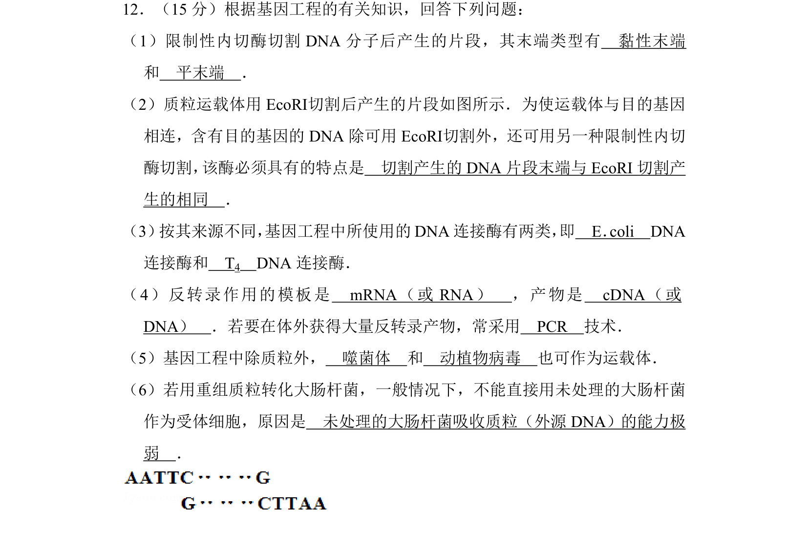
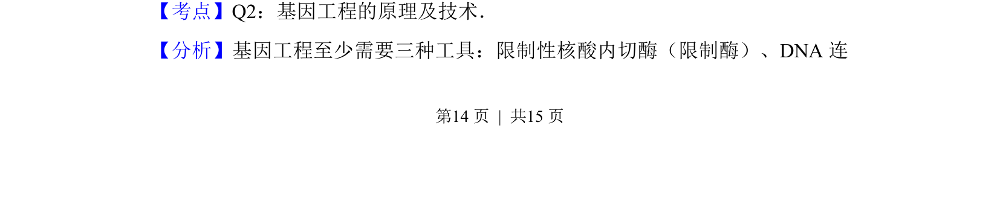
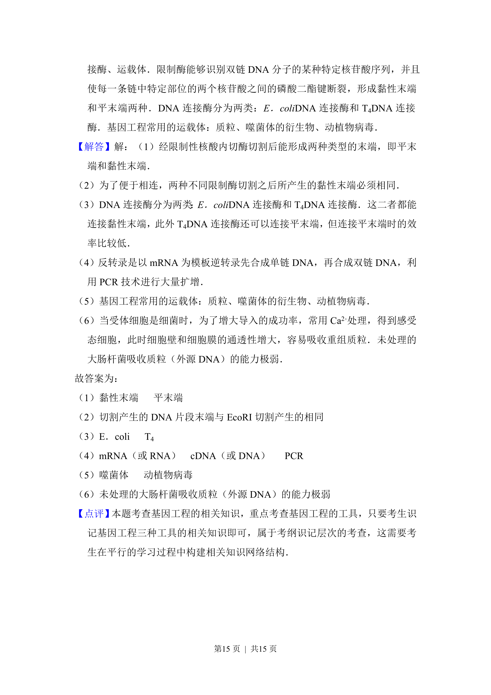

## 题面

## 摘要

本题考查基因工程工具酶、运载体、反转录及受体细胞处理等基础知识。

## 关联考点

- [[422-限制性核酸内切酶|限制酶]]
- [[409-DNA连接酶|DNA连接酶]]
- [[运载体]]
- [[513-逆转录|反转录]]

## 答案与解析

> 📄 原 PDF 第 14 页：`素材/真题/湖南/2008-2024·（湖南）生物高考真题/2012年高考生物试卷（新课标）（解析卷）.pdf`

<!-- 题干文本-start -->
## 题干文本
12．（15分）根据基因工程的有关知识，回答下列问题：
（1）限制性内切酶切割DNA分子后产生的片段，其末端类型有　黏性末端　
和　平末端　．
（2）质粒运载体用EcoRⅠ切割后产生的片段如图所示．为使运载体与目的基因
相连，含有目的基因的DNA除可用EcoRⅠ切割外，还可用另一种限制性内切
酶切割， 该酶必须具有的特点是　切割产生的DNA片段末端与EcoRI切割产
生的相同　．
（3） 按其来源不同， 基因工程中所使用的DNA连接酶有两类， 即　E．coli　DNA
连接酶和　T4　DNA连接酶．
（4）反转录作用的模板是　mRNA（或RNA）　，产物是　cDNA（或
DNA）　．若要在体外获得大量反转录产物，常采用　PCR　技术．
（5）基因工程中除质粒外，　噬菌体　和　动植物病毒　也可作为运载体．
（6）若用重组质粒转化大肠杆菌，一般情况下，不能直接用未处理的大肠杆菌
作为受体细胞，原因是　未处理的大肠杆菌吸收质粒（外源DNA）的能力极
弱　．
<!-- 题干文本-end -->

<!-- 解析文本-start -->
## 解析文本
【考点】Q2：基因工程的原理及技术．菁优网版权所有
【分析】基因工程至少需要三种工具：限制性核酸内切酶（限制酶）、DNA连
<!-- 解析文本-end -->
