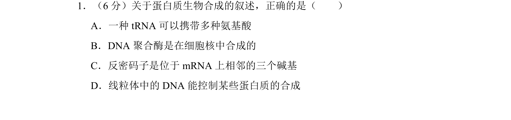
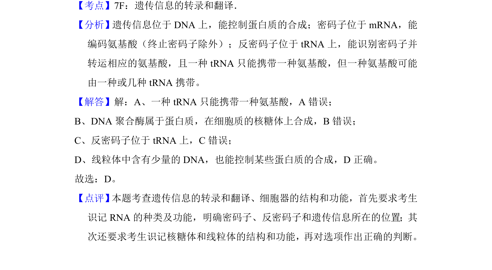

## 题面

## 摘要

该题考查遗传信息的转录和翻译过程，涉及tRNA、反密码子、线粒体DNA等知识。

## 关联考点

- [[294-tRNA|tRNA]]
- [[反密码子]]
- [[线粒体DNA]]
- [[DNA聚合酶合成场所]]

## 答案与解析

> 📄 原 PDF 第 1 页：`素材/真题/湖南/2008-2024·（湖南）生物高考真题/2013年高考生物试卷（新课标Ⅰ）（解析卷）.pdf`
