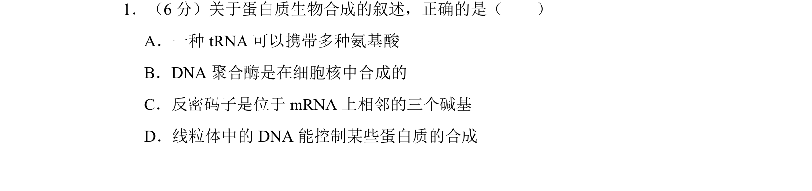
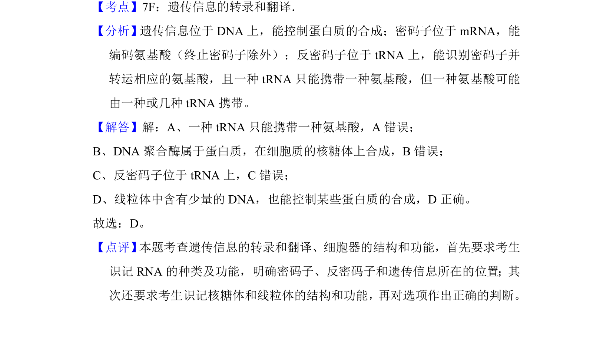

## 题面

## 摘要

该题考查遗传信息的转录和翻译过程，涉及tRNA、反密码子、线粒体DNA等知识。

## 关联考点

- [[294-tRNA|tRNA]]
- [[反密码子]]
- [[919-线粒体DNA|线粒体DNA]]
- [[DNA聚合酶合成场所]]

## 答案与解析

> 📄 原 PDF 第 1 页：`素材/真题/湖南/2008-2024·（湖南）生物高考真题/2013年高考生物试卷（新课标Ⅰ）（解析卷）.pdf`

<!-- 题干文本-start -->
## 题干文本
1．（6分）关于蛋白质生物合成的叙述，正确的是（　　）
A．一种tRNA可以携带多种氨基酸
B．DNA聚合酶是在细胞核中合成的
C．反密码子是位于mRNA上相邻的三个碱基
D．线粒体中的DNA能控制某些蛋白质的合成
<!-- 题干文本-end -->

<!-- 解析文本-start -->
## 解析文本
【考点】7F：遗传信息的转录和翻译．菁优网版权所有
【分析】遗传信息位于DNA上，能控制蛋白质的合成；密码子位于mRNA，能
编码氨基酸（终止密码子除外）；反密码子位于tRNA上，能识别密码子并
转运相应的氨基酸，且一种tRNA只能携带一种氨基酸，但一种氨基酸可能
由一种或几种tRNA携带。
【解答】解：A、一种tRNA只能携带一种氨基酸，A错误；
B、DNA聚合酶属于蛋白质，在细胞质的核糖体上合成，B错误；
C、反密码子位于tRNA上，C错误；
D、线粒体中含有少量的DNA，也能控制某些蛋白质的合成，D正确。
故选：D。
【点评】 本题考查遗传信息的转录和翻译、细胞器的结构和功能，首先要求考生
识记RNA的种类及功能，明确密码子、反密码子和遗传信息所在的位置；其
次还要求考生识记核糖体和线粒体的结构和功能，再对选项作出正确的判断。
<!-- 解析文本-end -->
