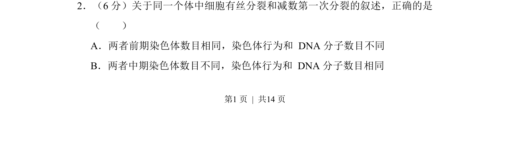
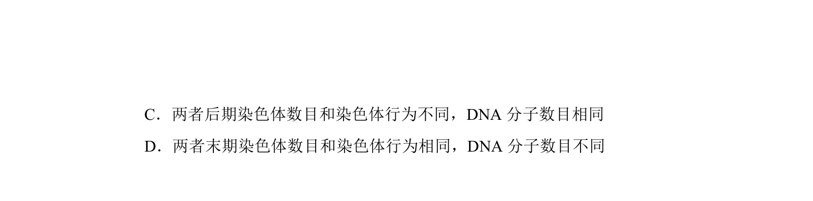
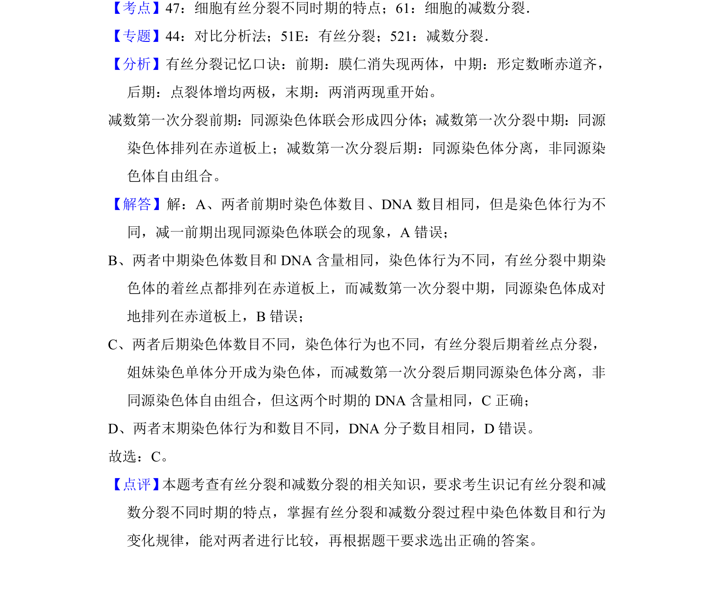

## 题面

## 摘要

比较有丝分裂与减数第一次分裂各时期染色体数目、行为和DNA分子数目的异同

## 关联考点

- [[046-细胞分裂|有丝分裂]]
- [[减数第一次分裂]]
- [[染色体行为]]
- [[DNA数目变化]]

## 答案与解析

> 📄 原 PDF 第 1 页：`素材/真题/湖南/2008-2024·（湖南）生物高考真题/2013年高考生物试卷（新课标Ⅰ）（解析卷）.pdf`
