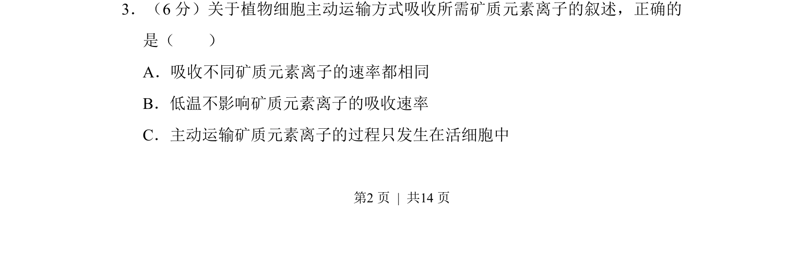
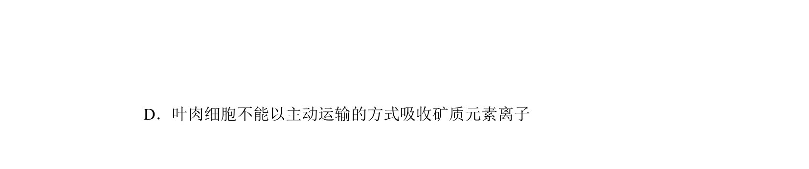
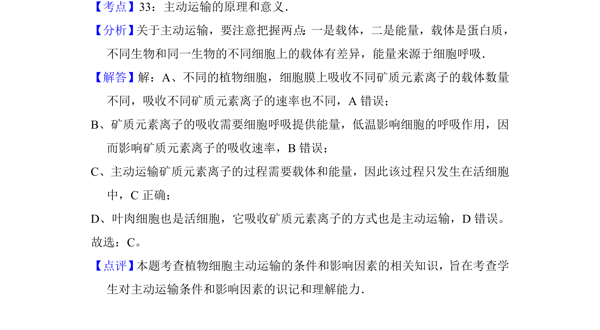

## 题面

## 摘要

考查主动运输特点及矿质元素离子吸收条件，需判断不同离子速率、温度影响及发生场所。

## 关联考点

- [[256-主动运输|主动运输]]
- [[659-矿质元素吸收|矿质元素吸收]]
- [[活细胞]]
- [[763-载体蛋白|载体蛋白]]

## 答案与解析

> 📄 原 PDF 第 2 页：`素材/真题/湖南/2008-2024·（湖南）生物高考真题/2013年高考生物试卷（新课标Ⅰ）（解析卷）.pdf`
