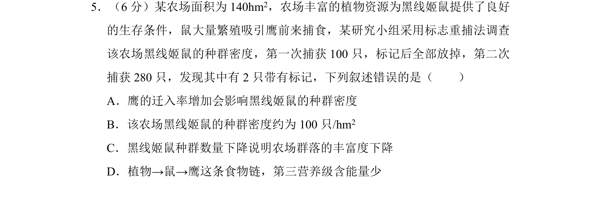
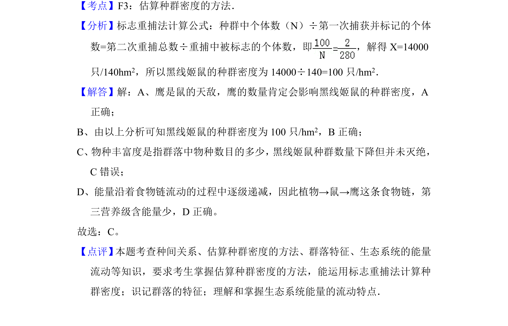

## 题面

## 摘要

该题考查标志重捕法估算种群密度，并分析捕食关系、物种丰富度及能量流动特点。

## 关联考点

- [[365-标志重捕法|标志重捕法]]
- [[370-种群密度|种群密度]]
- [[632-物种丰富度|物种丰富度]]
- [[385-生态系统能量流动|能量流动]]

## 答案与解析

> 📄 原 PDF 第 5 页：`素材/真题/湖南/2008-2024·（湖南）生物高考真题/2013年高考生物试卷（新课标Ⅰ）（解析卷）.pdf`
