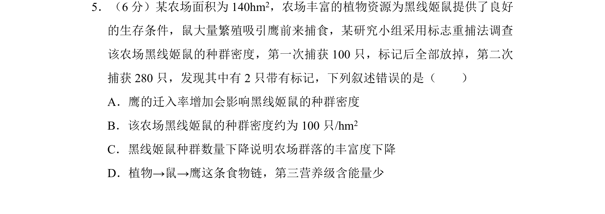
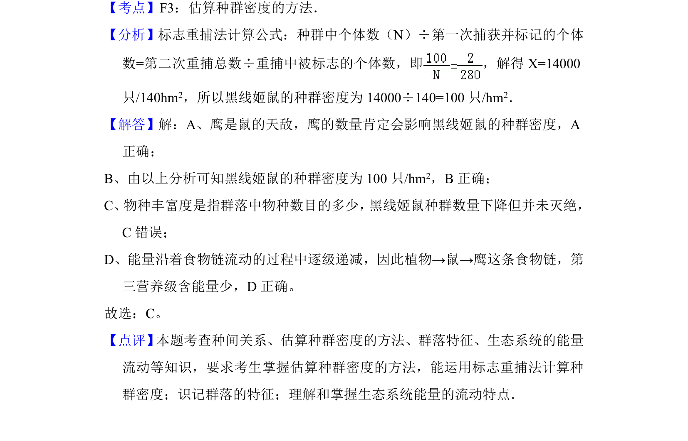

## 题面

## 摘要

该题考查标志重捕法估算种群密度，并分析捕食关系、物种丰富度及能量流动特点。

## 关联考点

- [[365-标志重捕法|标志重捕法]]
- [[370-种群密度|种群密度]]
- [[632-物种丰富度|物种丰富度]]
- [[385-生态系统能量流动|能量流动]]

## 答案与解析

> 📄 原 PDF 第 5 页：`素材/真题/湖南/2008-2024·（湖南）生物高考真题/2013年高考生物试卷（新课标Ⅰ）（解析卷）.pdf`

<!-- 题干文本-start -->
## 题干文本
5．（6分）某农场面积为140hm 2，农场丰富的植物资源为黑线姬鼠提供了良好
的生存条件，鼠大量繁殖吸引鹰前来捕食，某研究小组采用标志重捕法调查
该农场黑线姬鼠的种群密度，第一次捕获100只，标记后全部放掉，第二次
捕获280只，发现其中有2只带有标记，下列叙述错误的是（　　）
A．鹰的迁入率增加会影响黑线姬鼠的种群密度
B．该农场黑线姬鼠的种群密度约为100只/hm 2
C．黑线姬鼠种群数量下降说明农场群落的丰富度下降
D．植物→鼠→鹰这条食物链，第三营养级含能量少
<!-- 题干文本-end -->

<!-- 解析文本-start -->
## 解析文本
【考点】F3：估算种群密度的方法．菁优网版权所有
【分析】标志重捕法计算公式：种群中个体数（N）÷第一次捕获并标记的个体
数=第二次重捕总数÷重捕中被标志的个体数，即 ，解得X=14000
只/140hm2，所以黑线姬鼠的种群密度为14000÷140=100只/hm 2．
【解答】解：A、鹰是鼠的天敌，鹰的数量肯定会影响黑线姬鼠的种群密度，A
正确；
B、由以上分析可知黑线姬鼠的种群密度为100只/hm 2，B正确；
C、 物种丰富度是指群落中物种数目的多少， 黑线姬鼠种群数量下降但并未灭绝，
C错误；
D、能量沿着食物链流动的过程中逐级递减，因此植物→鼠→鹰这条食物链，第
三营养级含能量少，D正确。
故选：C。
【点评】 本题考查种间关系、估算种群密度的方法、群落特征、生态系统的能量
流动等知识，要求考生掌握估算种群密度的方法，能运用标志重捕法计算种
群密度；识记群落的特征；理解和掌握生态系统能量的流动特点．
<!-- 解析文本-end -->
