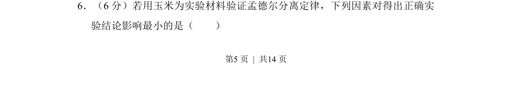
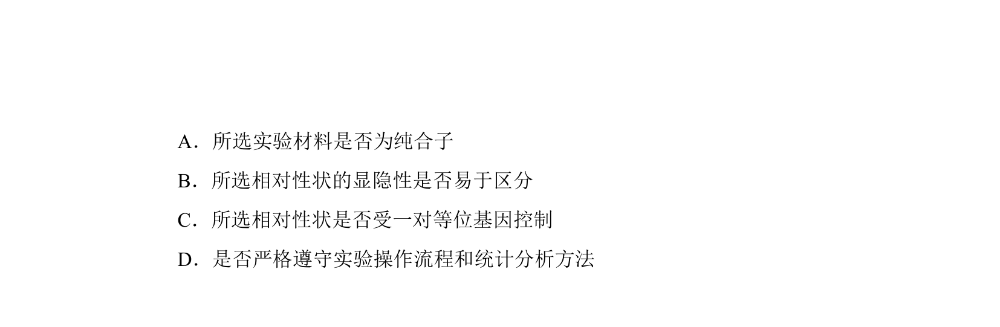
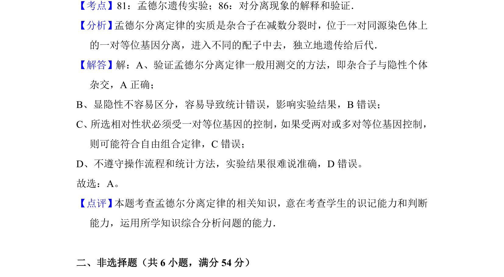

## 题面

## 摘要

本题考查验证孟德尔分离定律实验的影响因素分析。

## 关联考点

- [[845-孟德尔分离定律|孟德尔分离定律]]
- [[481-实验材料|实验材料]]
- [[482-实验设计|实验设计]]

## 答案与解析

> 📄 原 PDF 第 5 页：`素材/真题/湖南/2008-2024·（湖南）生物高考真题/2013年高考生物试卷（新课标Ⅰ）（解析卷）.pdf`
