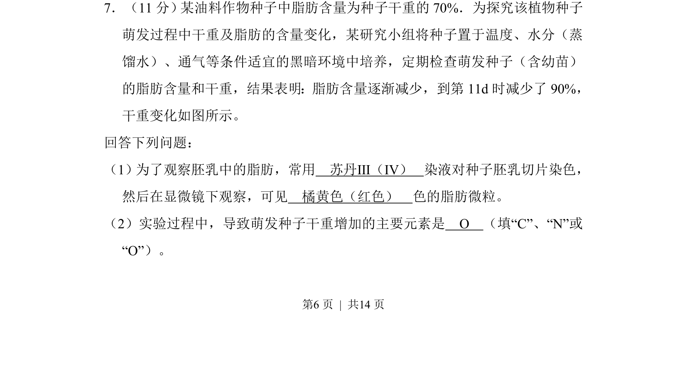
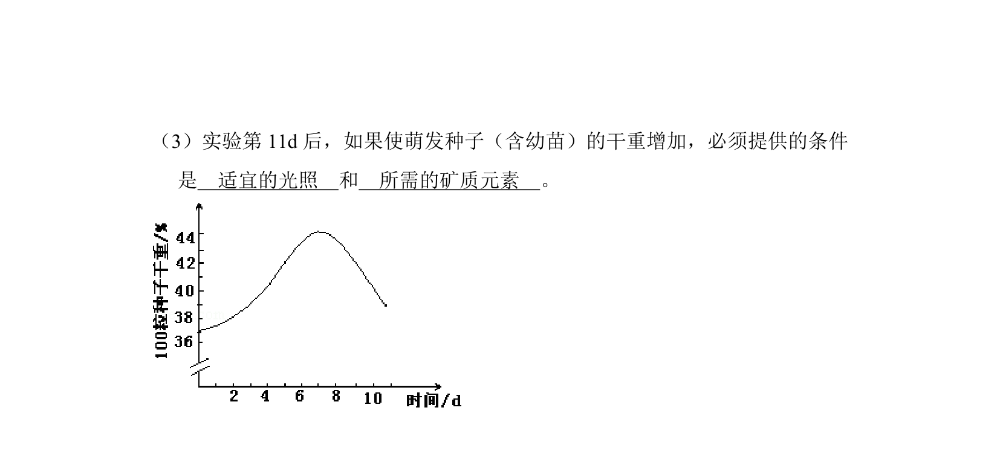
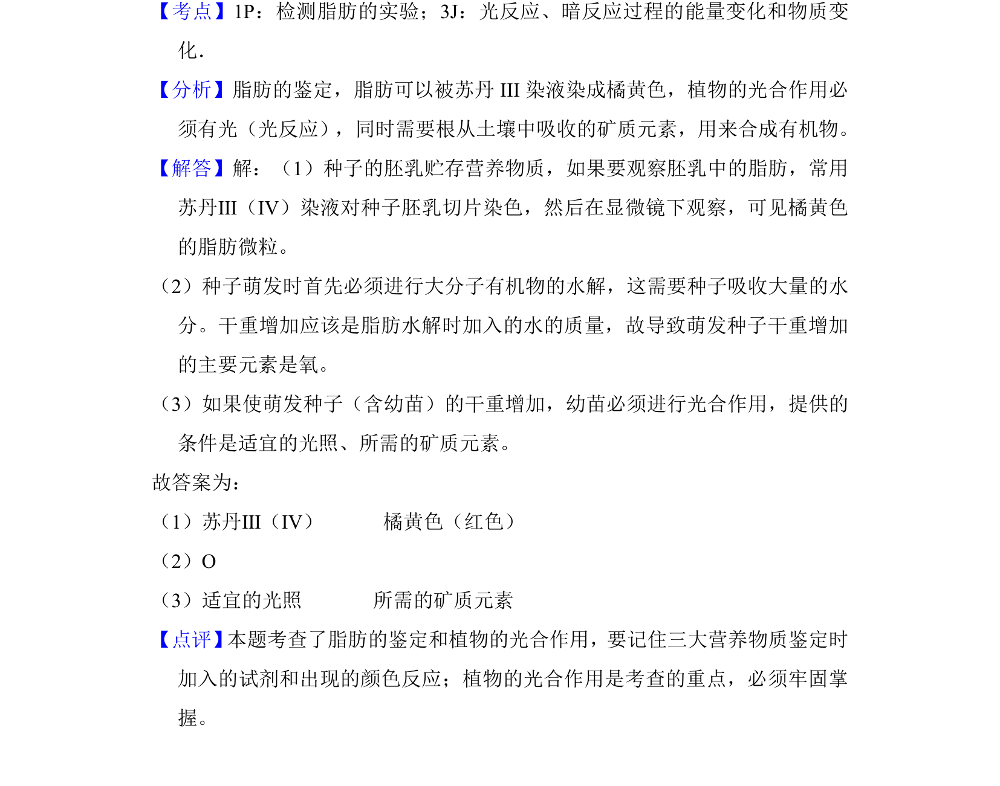

## 题面

## 摘要

探究种子萌发过程中脂肪含量减少与干重变化的关系，涉及脂肪鉴定及元素分析。

## 关联考点

- [[922-脂肪鉴定|脂肪鉴定]]
- [[015-种子萌发|种子萌发]]
- [[物质转化]]
- [[元素分析]]

## 答案与解析

> 📄 原 PDF 第 6 页：`素材/真题/湖南/2008-2024·（湖南）生物高考真题/2013年高考生物试卷（新课标Ⅰ）（解析卷）.pdf`
