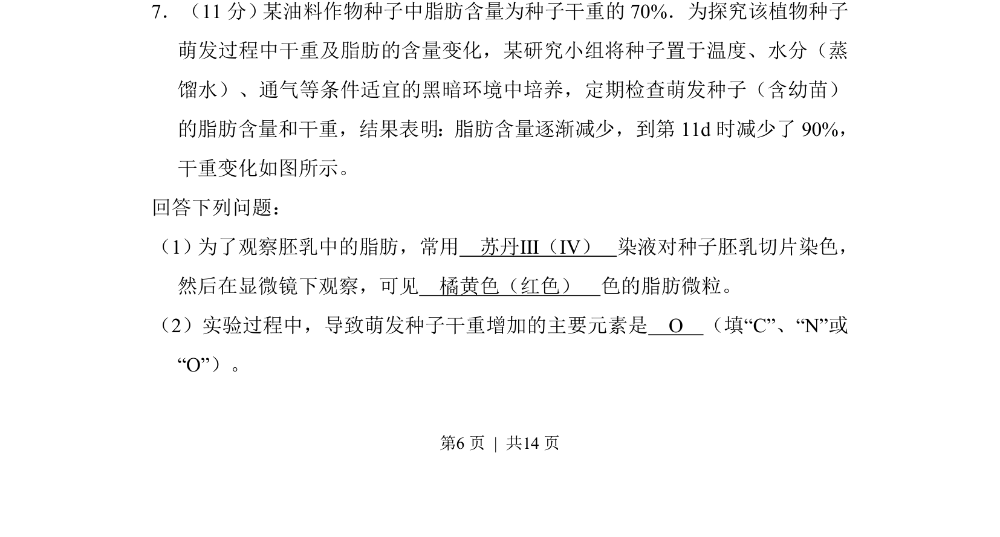
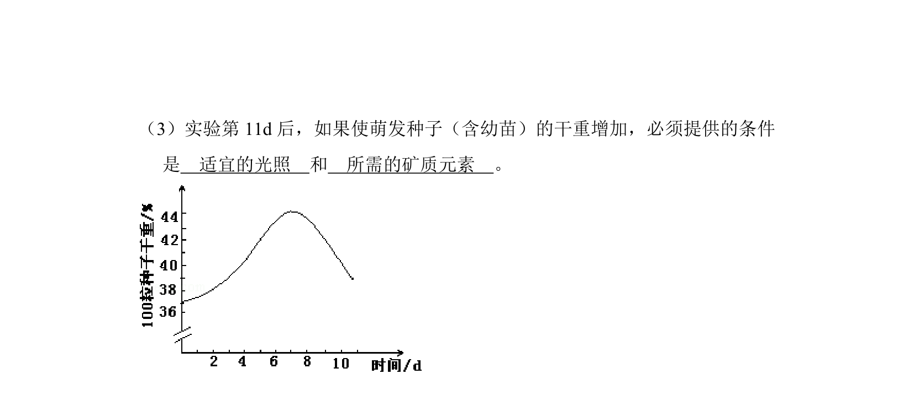
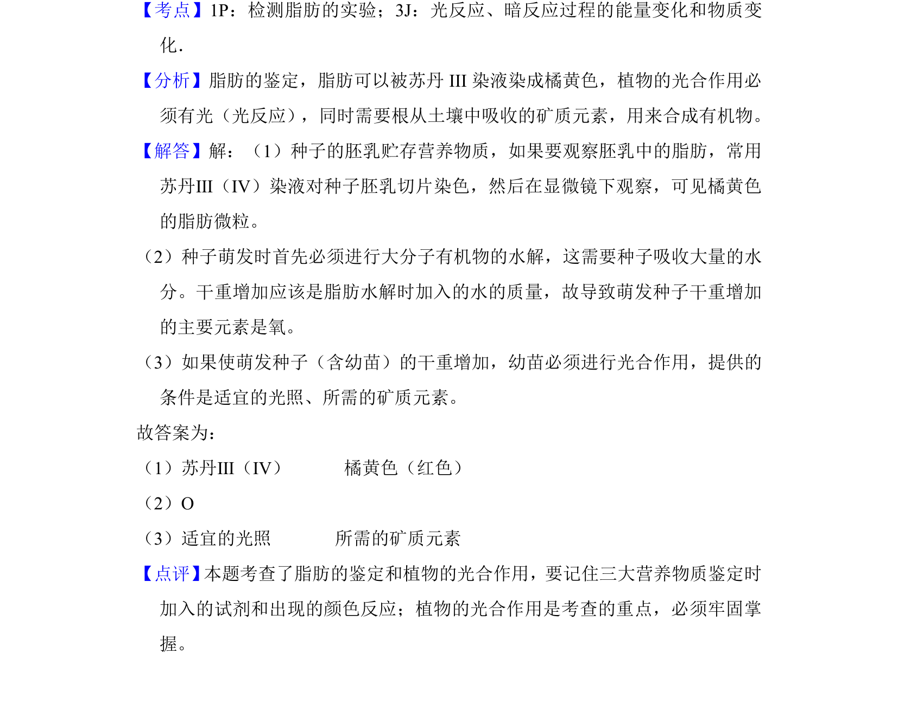

## 题面

## 摘要

探究种子萌发过程中脂肪含量减少与干重变化的关系，涉及脂肪鉴定及元素分析。

## 关联考点

- [[922-脂肪鉴定|脂肪鉴定]]
- [[015-种子萌发|种子萌发]]
- [[物质转化]]
- [[元素分析]]

## 答案与解析

> 📄 原 PDF 第 6 页：`素材/真题/湖南/2008-2024·（湖南）生物高考真题/2013年高考生物试卷（新课标Ⅰ）（解析卷）.pdf`

<!-- 题干文本-start -->
## 题干文本
7．（11分）某油料作物种子中脂肪含量为种子干重的70%．为探究该植物种子
萌发过程中干重及脂肪的含量变化，某研究小组将种子置于温度、水分（蒸
馏水）、通气等条件适宜的黑暗环境中培养，定期检查萌发种子（含幼苗）
的脂肪含量和干重，结果表明：脂肪含量逐渐减少，到第11d时减少了90%，
干重变化如图所示。
回答下列问题：
（1）为了观察胚乳中的脂肪，常用　苏丹Ⅲ（Ⅳ）　染液对种子胚乳切片染色，
然后在显微镜下观察，可见　橘黄色（红色）　色的脂肪微粒。
（2）实验过程中，导致萌发种子干重增加的主要元素是　O　（填“C”、“N”或
“O”）。
<!-- 题干文本-end -->

<!-- 解析文本-start -->
## 解析文本

<!-- 解析文本-end -->
