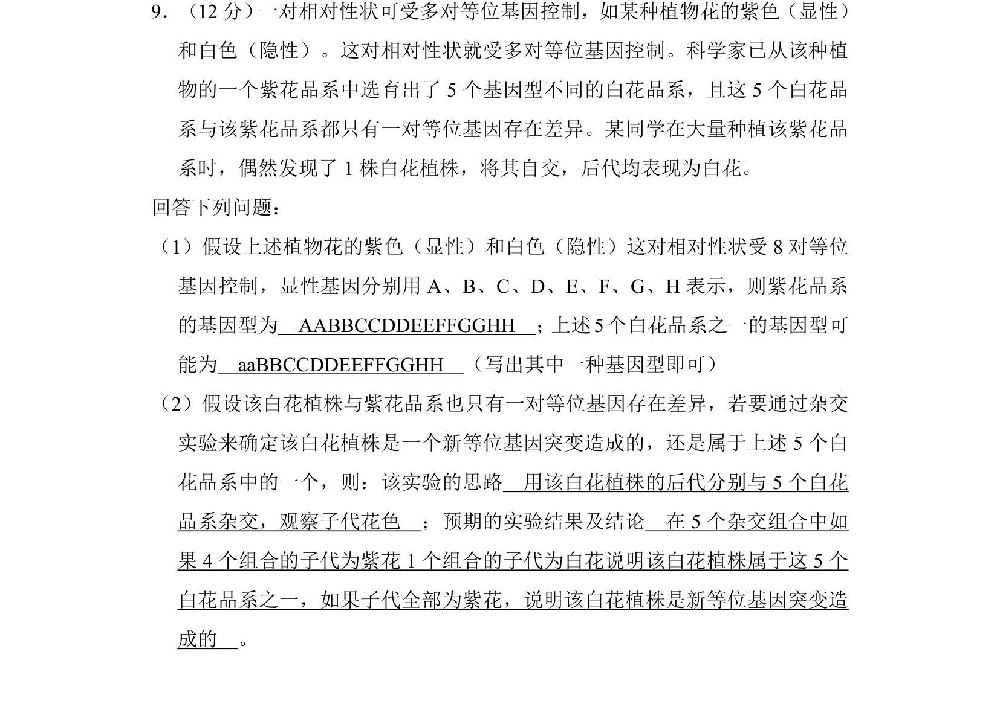
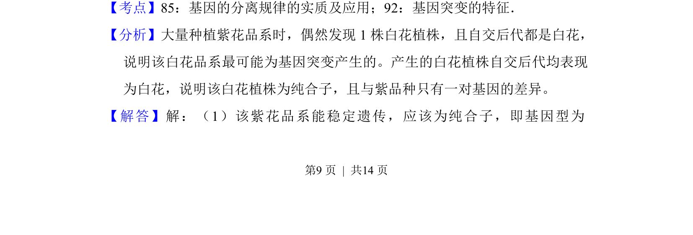
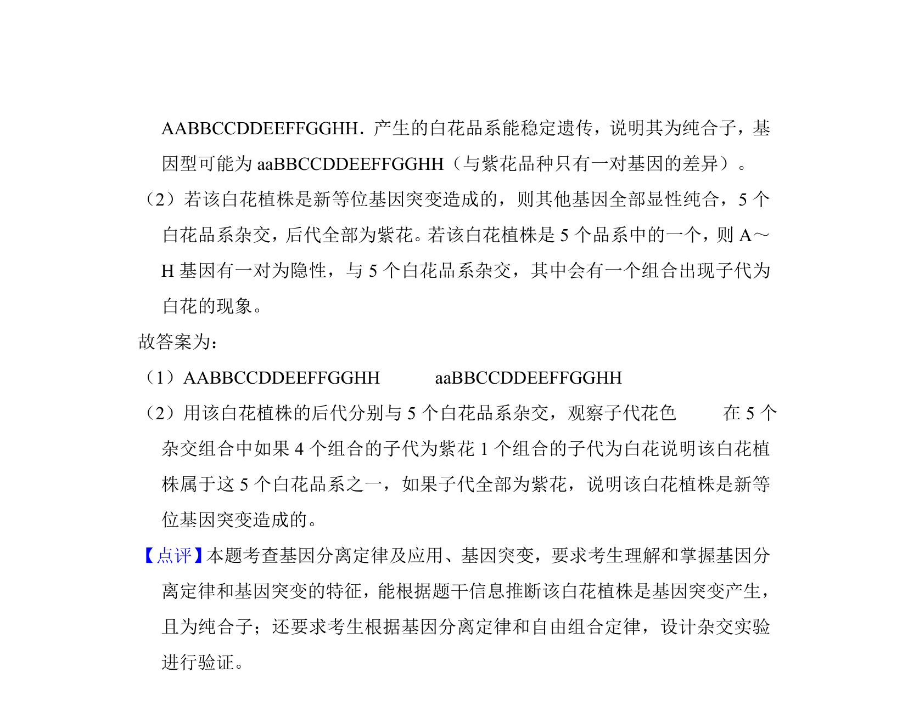

## 题面

## 摘要

该题考查多对等位基因控制相对性状的遗传规律及突变体杂交实验设计。

## 关联考点

- [[基因的分离规律]]
- [[301-基因突变|基因突变]]
- [[等位基因]]
- [[492-杂交实验|杂交实验]]

## 答案与解析

> 📄 原 PDF 第 9 页：`素材/真题/湖南/2008-2024·（湖南）生物高考真题/2013年高考生物试卷（新课标Ⅰ）（解析卷）.pdf`
