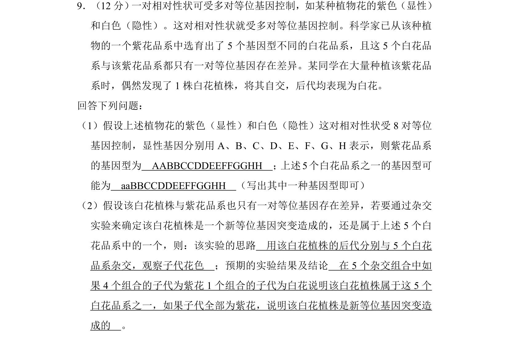
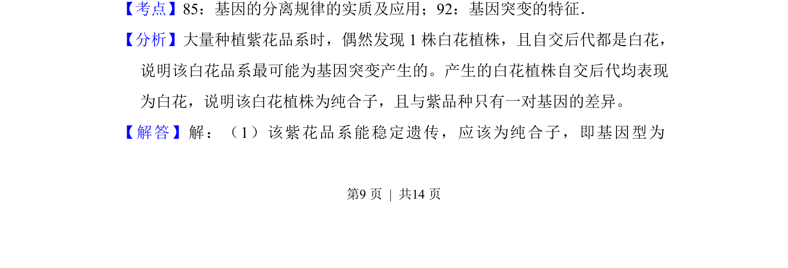
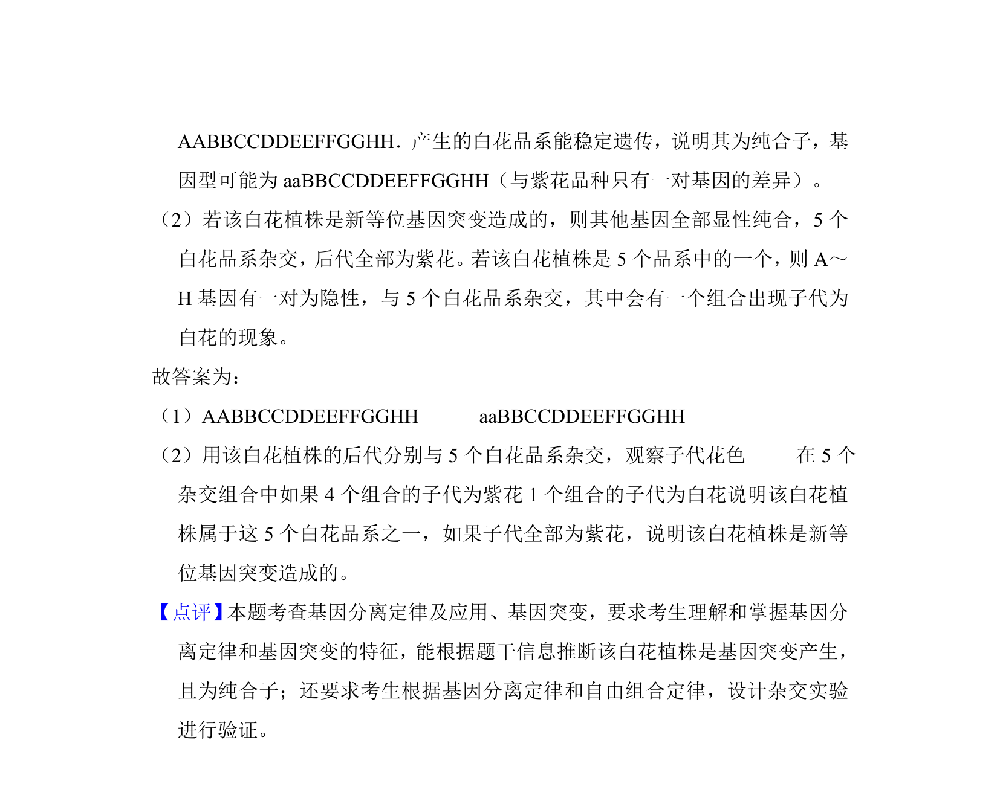

## 题面

## 摘要

该题考查多对等位基因控制相对性状的遗传规律及突变体杂交实验设计。

## 关联考点

- [[基因的分离规律]]
- [[301-基因突变|基因突变]]
- [[等位基因]]
- [[492-杂交实验|杂交实验]]

## 答案与解析

> 📄 原 PDF 第 9 页：`素材/真题/湖南/2008-2024·（湖南）生物高考真题/2013年高考生物试卷（新课标Ⅰ）（解析卷）.pdf`

<!-- 题干文本-start -->
## 题干文本
9．（12分） 一对相对性状可受多对等位基因控制，如某种植物花的紫色（显性）
和白色（隐性）。这对相对性状就受多对等位基因控制。科学家已从该种植
物的一个紫花品系中选育出了5个基因型不同的白花品系，且这5个白花品
系与该紫花品系都只有一对等位基因存在差异。某同学在大量种植该紫花品
系时，偶然发现了1株白花植株，将其自交，后代均表现为白花。
回答下列问题：
（1）假设上述植物花的紫色（显性）和白色（隐性）这对相对性状受8对等位
基因控制，显性基因分别用A、B、C、D、E、F、G、H表示，则紫花品系
的基因型为　AABBCCDDEEFFGGHH　； 上述5个白花品系之一的基因型可
能为　aaBBCCDDEEFFGGHH　（写出其中一种基因型即可）
（2）假设该白花植株与紫花品系也只有一对等位基因存在差异，若要通过杂交
实验来确定该白花植株是一个新等位基因突变造成的，还是属于上述5个白
花品系中的一个，则：该实验的思路　用该白花植株的后代分别与5个白花
品系杂交，观察子代花色　；预期的实验结果及结论　在5个杂交组合中如
果4个组合的子代为紫花1个组合的子代为白花说明该白花植株属于这5个
白花品系之一，如果子代全部为紫花，说明该白花植株是新等位基因突变造
成的　。
<!-- 题干文本-end -->

<!-- 解析文本-start -->
## 解析文本
【考点】85：基因的分离规律的实质及应用；92：基因突变的特征．菁优网版权所有
【分析】大量种植紫花品系时，偶然发现1株白花植株，且自交后代都是白花，
说明该白花品系最可能为基因突变产生的。产生的白花植株自交后代均表现
为白花，说明该白花植株为纯合子，且与紫品种只有一对基因的差异。
【解答】解：（1）该紫花品系能稳定遗传，应该为纯合子，即基因型为
<!-- 解析文本-end -->
