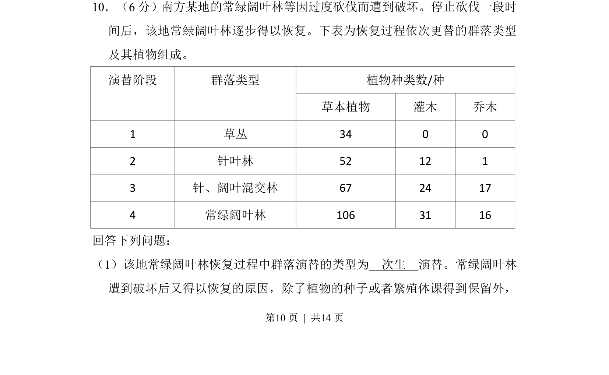
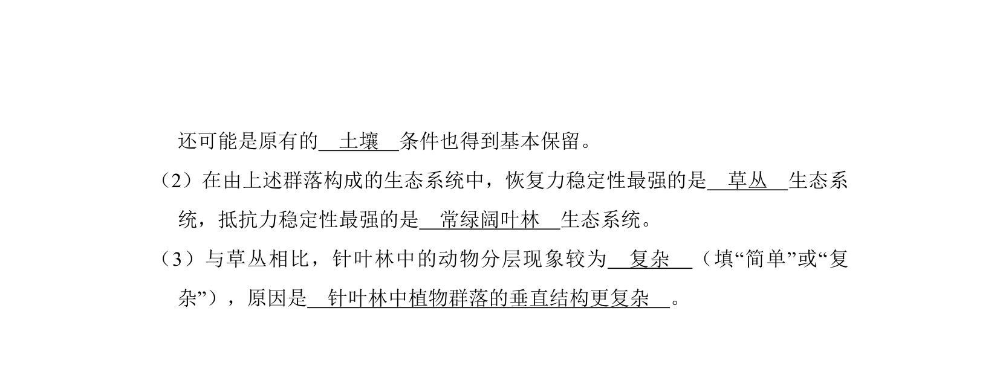
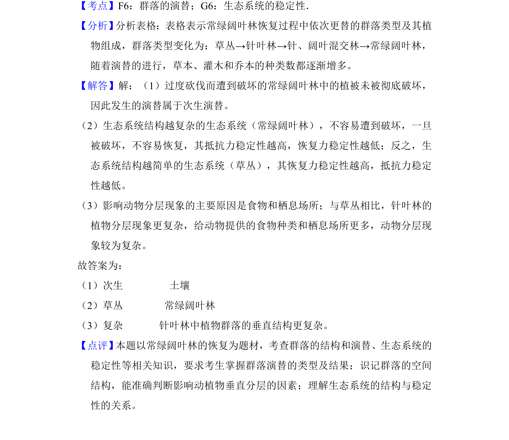

## 题面

## 摘要

群落演替类型判断及恢复原因分析

## 关联考点

- [[917-次生演替|次生演替]]
- [[407-群落演替|群落演替]]
- [[物种组成]]

## 答案与解析

> 📄 原 PDF 第 10 页：`素材/真题/湖南/2008-2024·（湖南）生物高考真题/2013年高考生物试卷（新课标Ⅰ）（解析卷）.pdf`

<!-- 题干文本-start -->
## 题干文本
10．（6分）南方某地的常绿阔叶林等因过度砍伐而遭到破坏。停止砍伐一段时
间后，该地常绿阔叶林逐步得以恢复。下表为恢复过程依次更替的群落类型
及其植物组成。
植物种类数/种演替阶段 群落类型
草本植物 灌木 乔木
1 草丛 34 0 0
2 针叶林 52 12 1
3 针、阔叶混交林 67 24 17
4 常绿阔叶林 106 31 16
回答下列问题：
（1）该地常绿阔叶林恢复过程中群落演替的类型为　次生　演替。常绿阔叶林
遭到破坏后又得以恢复的原因，除了植物的种子或者繁殖体课得到保留外，
<!-- 题干文本-end -->

<!-- 解析文本-start -->
## 解析文本

<!-- 解析文本-end -->
