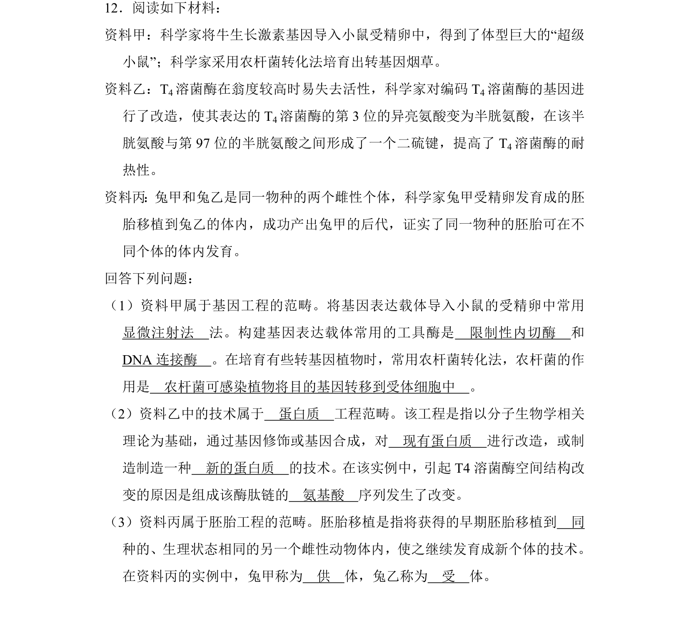
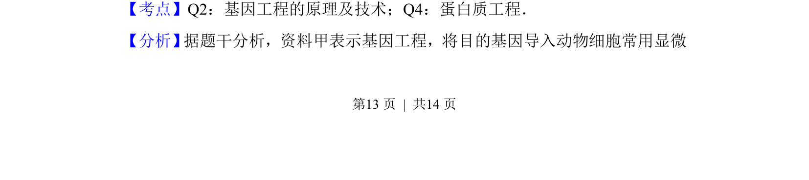
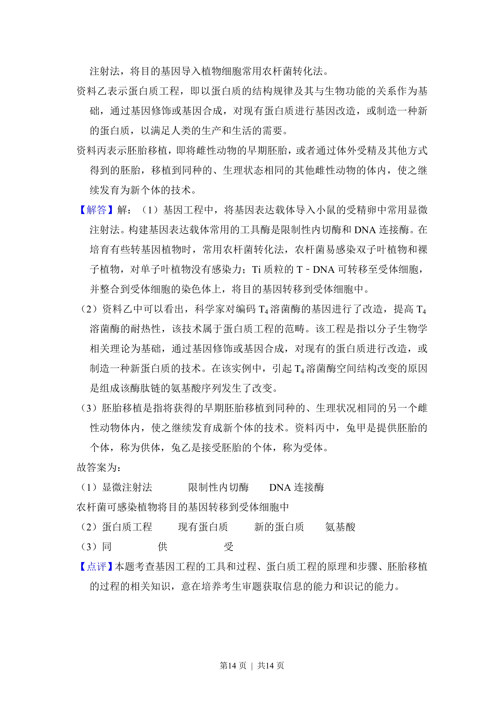

## 题面

## 摘要

该题通过三段资料考查基因工程、蛋白质工程和胚胎工程的基本概念与技术。

## 关联考点

- [[411-基因工程|基因工程]]
- [[698-蛋白质工程|蛋白质工程]]
- [[455-胚胎工程|胚胎工程]]
- [[工具酶]]

## 答案与解析

> 📄 原 PDF 第 13 页：`素材/真题/湖南/2008-2024·（湖南）生物高考真题/2013年高考生物试卷（新课标Ⅰ）（解析卷）.pdf`
