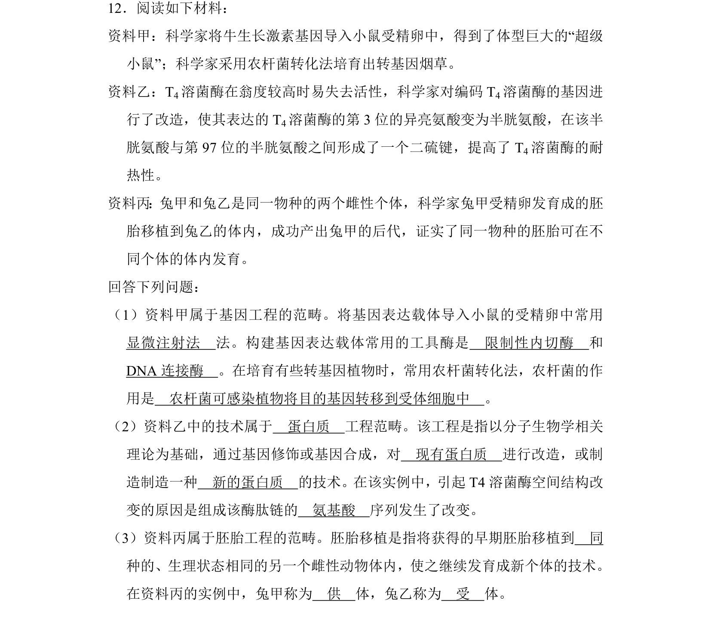
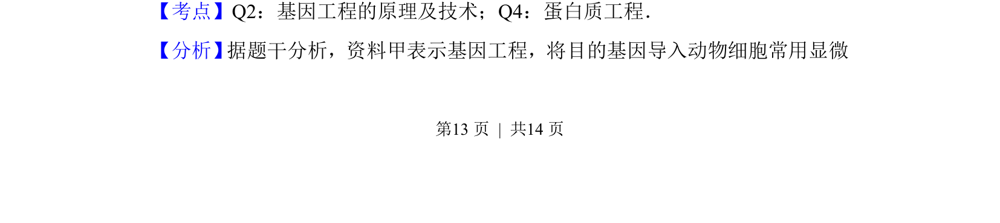
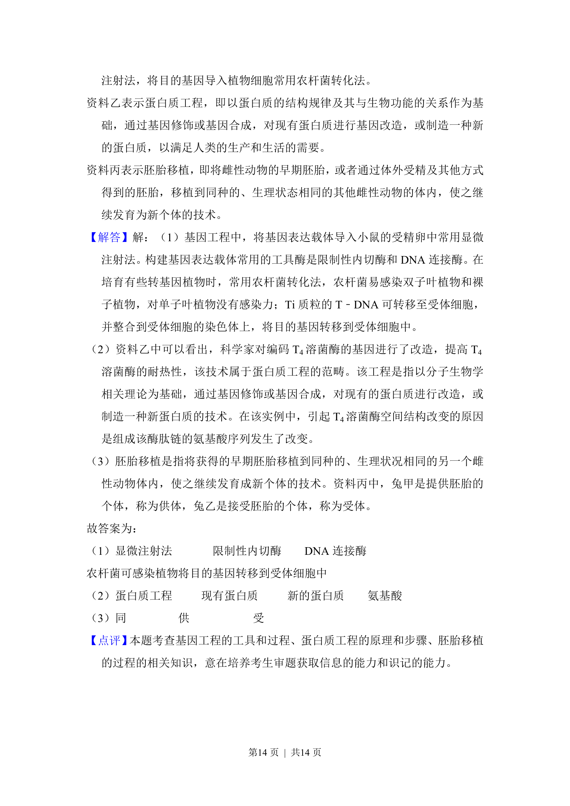

## 题面

## 摘要

该题通过三段资料考查基因工程、蛋白质工程和胚胎工程的基本概念与技术。

## 关联考点

- [[411-基因工程|基因工程]]
- [[698-蛋白质工程|蛋白质工程]]
- [[455-胚胎工程|胚胎工程]]
- [[工具酶]]

## 答案与解析

> 📄 原 PDF 第 13 页：`素材/真题/湖南/2008-2024·（湖南）生物高考真题/2013年高考生物试卷（新课标Ⅰ）（解析卷）.pdf`

<!-- 题干文本-start -->
## 题干文本
12．阅读如下材料：
资料甲：科学家将牛生长激素基因导入小鼠受精卵中，得到了体型巨大的“超级
小鼠”；科学家采用农杆菌转化法培育出转基因烟草。
资料乙：T4溶菌酶在翁度较高时易失去活性，科学家对编码T 4溶菌酶的基因进
行了改造，使其表达的T 4溶菌酶的第3位的异亮氨酸变为半胱氨酸，在该半
胱氨酸与第97位的半胱氨酸之间形成了一个二硫键，提高了T 4溶菌酶的耐
热性。
资料丙：兔甲和兔乙是同一物种的两个雌性个体，科学家兔甲受精卵发育成的胚
胎移植到兔乙的体内，成功产出兔甲的后代，证实了同一物种的胚胎可在不
同个体的体内发育。
回答下列问题：
（1）资料甲属于基因工程的范畴。将基因表达载体导入小鼠的受精卵中常用　
显微注射法　法。构建基因表达载体常用的工具酶是　限制性内切酶　和　
DNA连接酶　。在培育有些转基因植物时，常用农杆菌转化法，农杆菌的作
用是　农杆菌可感染植物将目的基因转移到受体细胞中　。
（2）资料乙中的技术属于　蛋白质　工程范畴。该工程是指以分子生物学相关
理论为基础，通过基因修饰或基因合成，对　现有蛋白质　进行改造，或制
造制造一种　新的蛋白质　的技术。在该实例中，引起T4溶菌酶空间结构改
变的原因是组成该酶肽链的　氨基酸　序列发生了改变。
（3）资料丙属于胚胎工程的范畴。胚胎移植是指将获得的早期胚胎移植到　同　
种的、生理状态相同的另一个雌性动物体内，使之继续发育成新个体的技术。
在资料丙的实例中，兔甲称为　供　体，兔乙称为　受　体。
<!-- 题干文本-end -->

<!-- 解析文本-start -->
## 解析文本
【考点】Q2：基因工程的原理及技术；Q4：蛋白质工程．菁优网版权所有
【分析】 据题干分析，资料甲表示基因工程，将目的基因导入动物细胞常用显微
<!-- 解析文本-end -->
