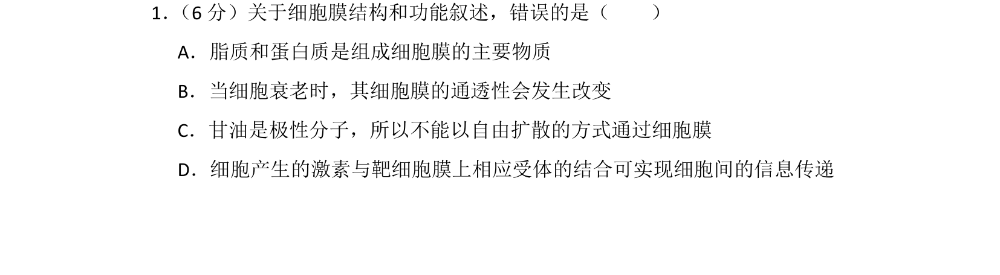
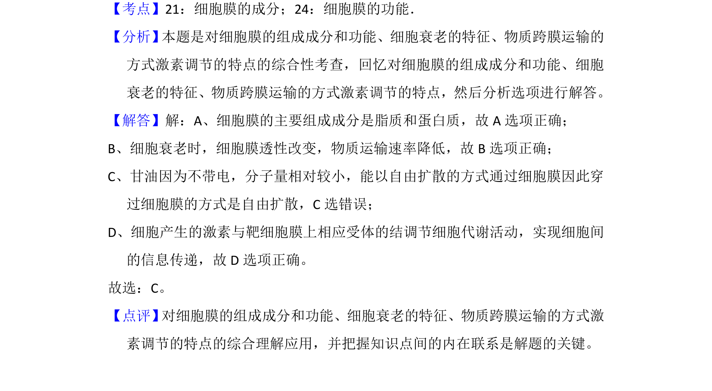

## 题面

## 摘要

本题辨析细胞膜的成分、功能、衰老特征及物质运输方式，指出甘油能以自由扩散通过细胞膜。

## 关联考点

- [[细胞膜的成分]]
- [[细胞膜的功能]]
- [[635-物质跨膜运输|物质跨膜运输]]
- [[254-细胞衰老|细胞衰老]]

## 答案与解析

> 📄 原 PDF 第 1 页：`素材/真题/湖南/2008-2024·（湖南）生物高考真题/2014年高考生物试卷（新课标Ⅰ）（解析卷）.pdf`
