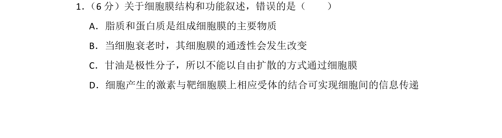
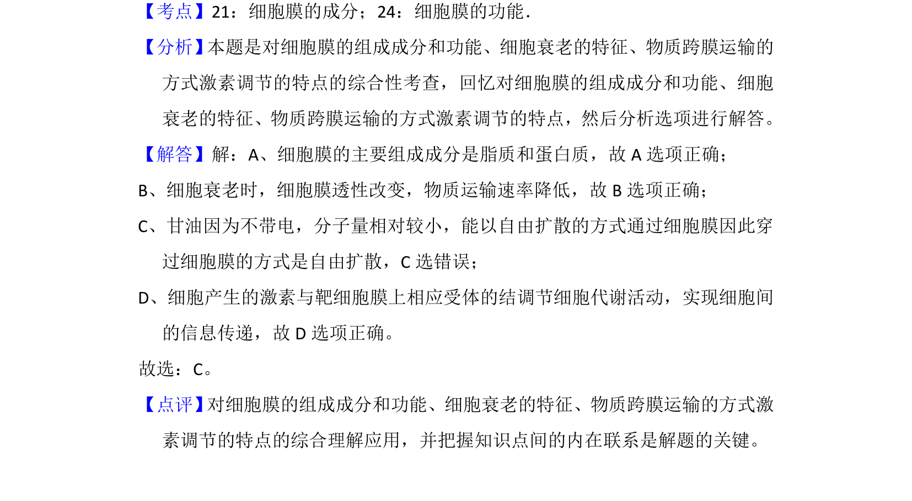

## 题面

## 摘要

本题辨析细胞膜的成分、功能、衰老特征及物质运输方式，指出甘油能以自由扩散通过细胞膜。

## 关联考点

- [[细胞膜的成分]]
- [[细胞膜的功能]]
- [[635-物质跨膜运输|物质跨膜运输]]
- [[254-细胞衰老|细胞衰老]]

## 答案与解析

> 📄 原 PDF 第 1 页：`素材/真题/湖南/2008-2024·（湖南）生物高考真题/2014年高考生物试卷（新课标Ⅰ）（解析卷）.pdf`

<!-- 题干文本-start -->
## 题干文本
1． （6分）关于细胞膜结构和功能叙述，错误的是（　　）
A．脂质和蛋白质是组成细胞膜的主要物质
B．当细胞衰老时，其细胞膜的通透性会发生改变
C．甘油是极性分子，所以不能以自由扩散的方式通过细胞膜
D．细胞产生的激素与靶细胞膜上相应受体的结合可实现细胞间的信息传递
<!-- 题干文本-end -->

<!-- 解析文本-start -->
## 解析文本
【考点】21：细胞膜的成分；24：细胞膜的功能．菁优网版权所有
【分析】 本题是对细胞膜的组成成分和功能、细胞衰老的特征、物质跨膜运输的
方式激素调节的特点的综合性考查，回忆对细胞膜的组成成分和功能、细胞
衰老的特征、物质跨膜运输的方式激素调节的特点，然后分析选项进行解答。
【解答】解：A、细胞膜的主要组成成分是脂质和蛋白质，故A选项正确；
B、细胞衰老时，细胞膜透性改变，物质运输速率降低，故B选项正确；
C、甘油因为不带电，分子量相对较小，能以自由扩散的方式通过细胞膜因此穿
过细胞膜的方式是自由扩散，C选错误；
D、细胞产生的激素与靶细胞膜上相应受体的结调节细胞代谢活动，实现细胞间
的信息传递，故D选项正确。
故选：C。
【点评】 对细胞膜的组成成分和功能、细胞衰老的特征、物质跨膜运输的方式激
素调节的特点的综合理解应用，并把握知识点间的内在联系是解题的关键。
<!-- 解析文本-end -->
