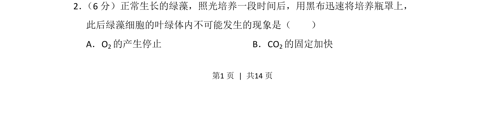
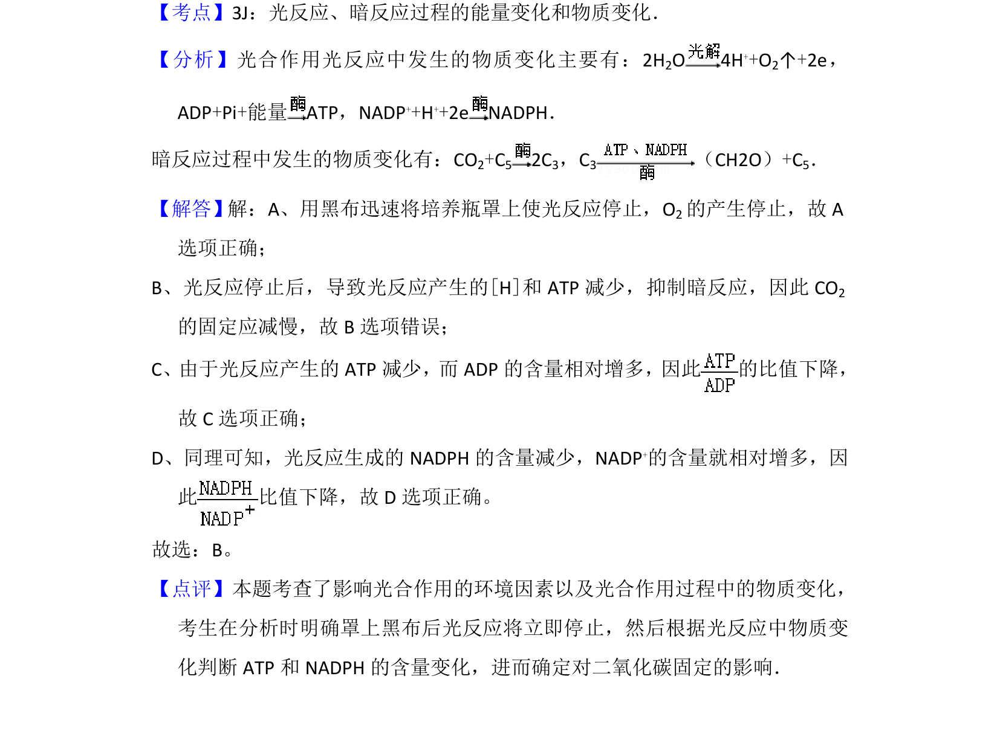

## 题面

## 摘要

绿藻照光后突然停止光照，分析叶绿体内光反应和暗反应的可能变化。

## 关联考点

- [[033-光合作用|光合作用]]
- [[236-光反应|光反应]]
- [[239-暗反应|暗反应]]
- [[CO₂固定]]

## 答案与解析

> 📄 原 PDF 第 1 页：`素材/真题/湖南/2008-2024·（湖南）生物高考真题/2014年高考生物试卷（新课标Ⅰ）（解析卷）.pdf`
