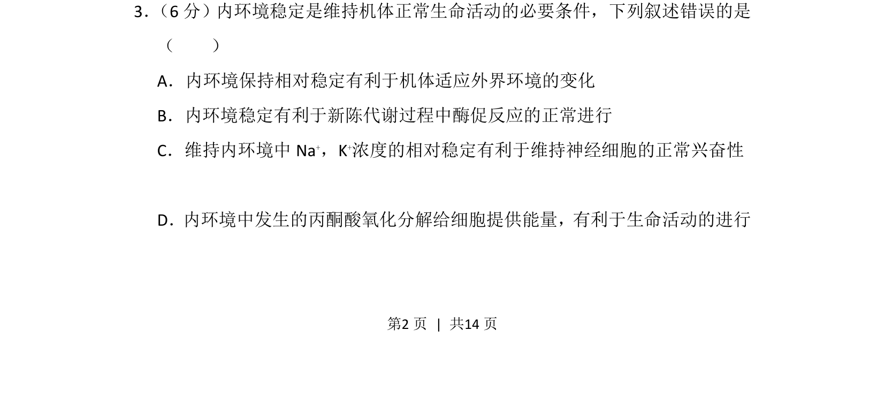
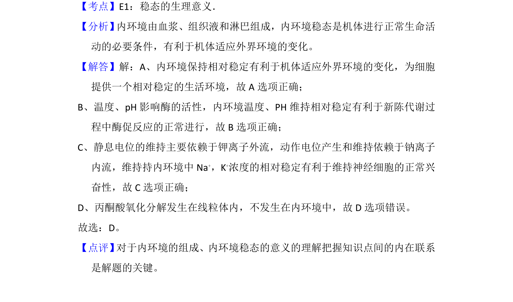

## 题面

## 摘要

考查内环境稳态的生理意义及内环境组成，判断错误叙述。

## 关联考点

- [[314-内环境稳态|内环境稳态]]
- [[神经兴奋性]]
- [[酶促反应]]
- [[有氧呼吸场所]]

## 答案与解析

> 📄 原 PDF 第 2 页：`素材/真题/湖南/2008-2024·（湖南）生物高考真题/2014年高考生物试卷（新课标Ⅰ）（解析卷）.pdf`

<!-- 题干文本-start -->
## 题干文本
3． （6分）内环境稳定是维持机体正常生命活动的必要条件，下列叙述错误的是
（　　）
A．内环境保持相对稳定有利于机体适应外界环境的变化
B．内环境稳定有利于新陈代谢过程中酶促反应的正常进行
C．维持内环境中Na +，K+浓度的相对稳定有利于维持神经细胞的正常兴奋性
D．内环境中发生的丙酮酸氧化分解给细胞提供能量，有利于生命活动的进行
<!-- 题干文本-end -->

<!-- 解析文本-start -->
## 解析文本

<!-- 解析文本-end -->
