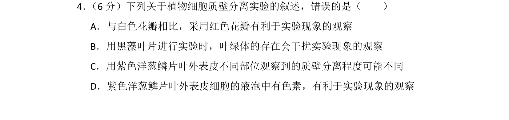
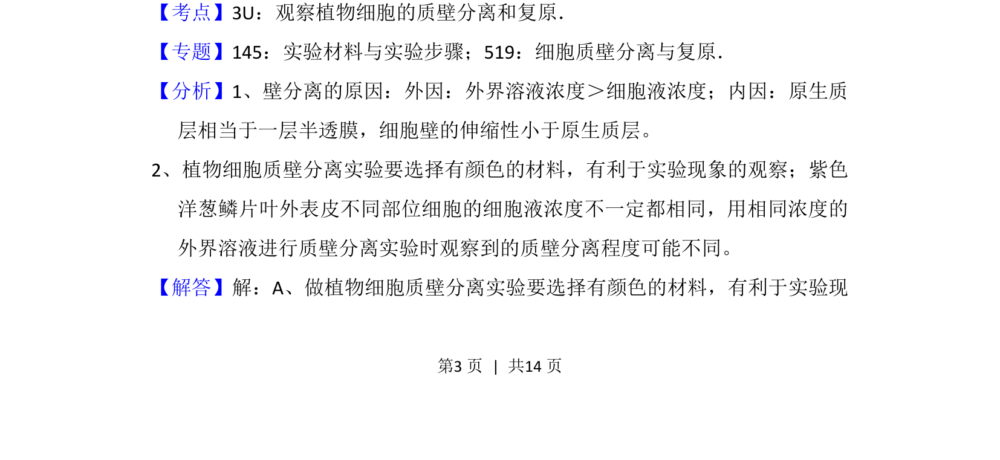
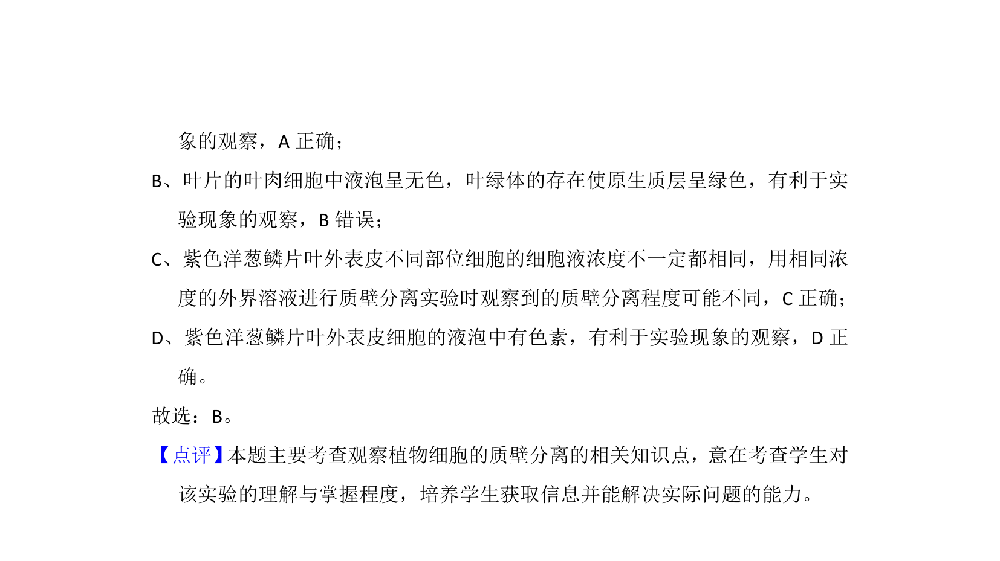

## 题面

## 摘要

本题考查植物细胞质壁分离实验的材料选择及观察注意事项

## 关联考点

- [[262-质壁分离|质壁分离]]
- [[481-实验材料|实验材料]]
- [[液泡色素]]
- [[细胞液浓度]]

## 答案与解析

> 📄 原 PDF 第 3 页：`素材/真题/湖南/2008-2024·（湖南）生物高考真题/2014年高考生物试卷（新课标Ⅰ）（解析卷）.pdf`

<!-- 题干文本-start -->
## 题干文本
4． （6分）下列关于植物细胞质壁分离实验的叙述，错误的是（　　）
A．与白色花瓣相比，采用红色花瓣有利于实验现象的观察
B．用黑藻叶片进行实验时，叶绿体的存在会干扰实验现象的观察
C．用紫色洋葱鳞片叶外表皮不同部位观察到的质壁分离程度可能不同
D．紫色洋葱鳞片叶外表皮细胞的液泡中有色素，有利于实验现象的观察
<!-- 题干文本-end -->

<!-- 解析文本-start -->
## 解析文本
【考点】3U：观察植物细胞的质壁分离和复原．菁优网版权所有
【专题】145：实验材料与实验步骤；519：细胞质壁分离与复原．
【分析】1、壁分离的原因：外因：外界溶液浓度＞细胞液浓度；内因：原生质
层相当于一层半透膜，细胞壁的伸缩性小于原生质层。
2、植物细胞质壁分离实验要选择有颜色的材料，有利于实验现象的观察；紫色
洋葱鳞片叶外表皮不同部位细胞的细胞液浓度不一定都相同，用相同浓度的
外界溶液进行质壁分离实验时观察到的质壁分离程度可能不同。
【解答】解：A、做植物细胞质壁分离实验要选择有颜色的材料，有利于实验现
<!-- 解析文本-end -->
