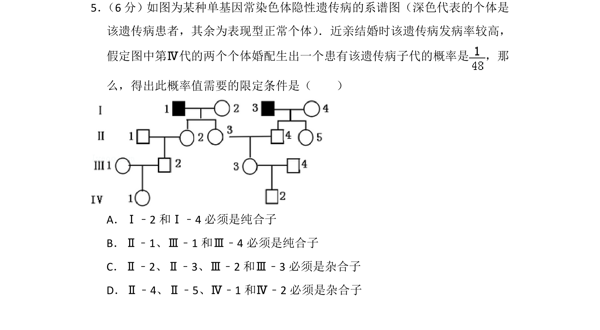
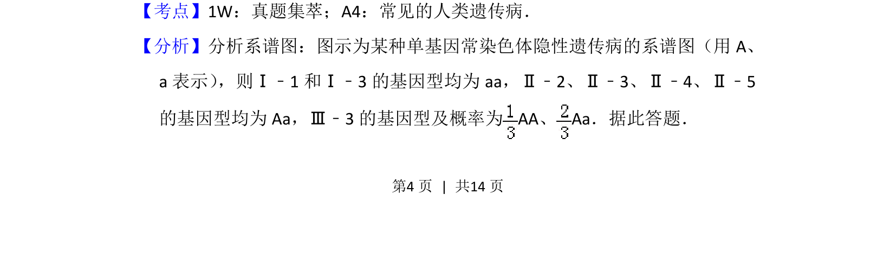
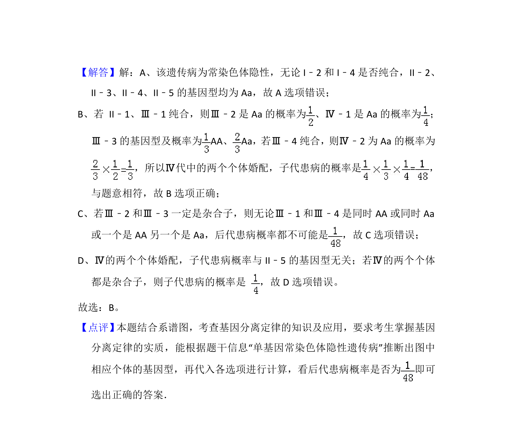

## 题面

## 摘要

考查单基因常染色体隐性遗传病系谱图分析及遗传概率计算条件限定。

## 关联考点

- [[常见的人类遗传病]]
- [[516-遗传系谱图分析|遗传系谱图分析]]
- [[948-概率计算|概率计算]]
- [[条件限定]]

## 答案与解析

> 📄 原 PDF 第 4 页：`素材/真题/湖南/2008-2024·（湖南）生物高考真题/2014年高考生物试卷（新课标Ⅰ）（解析卷）.pdf`
