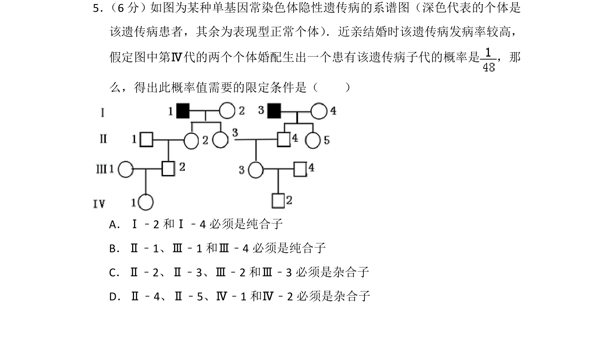
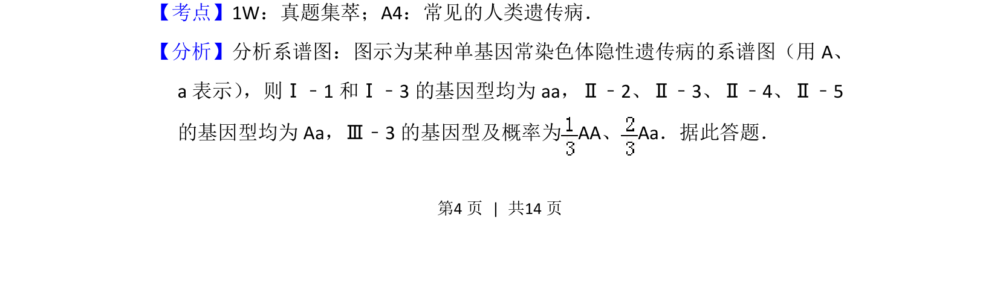
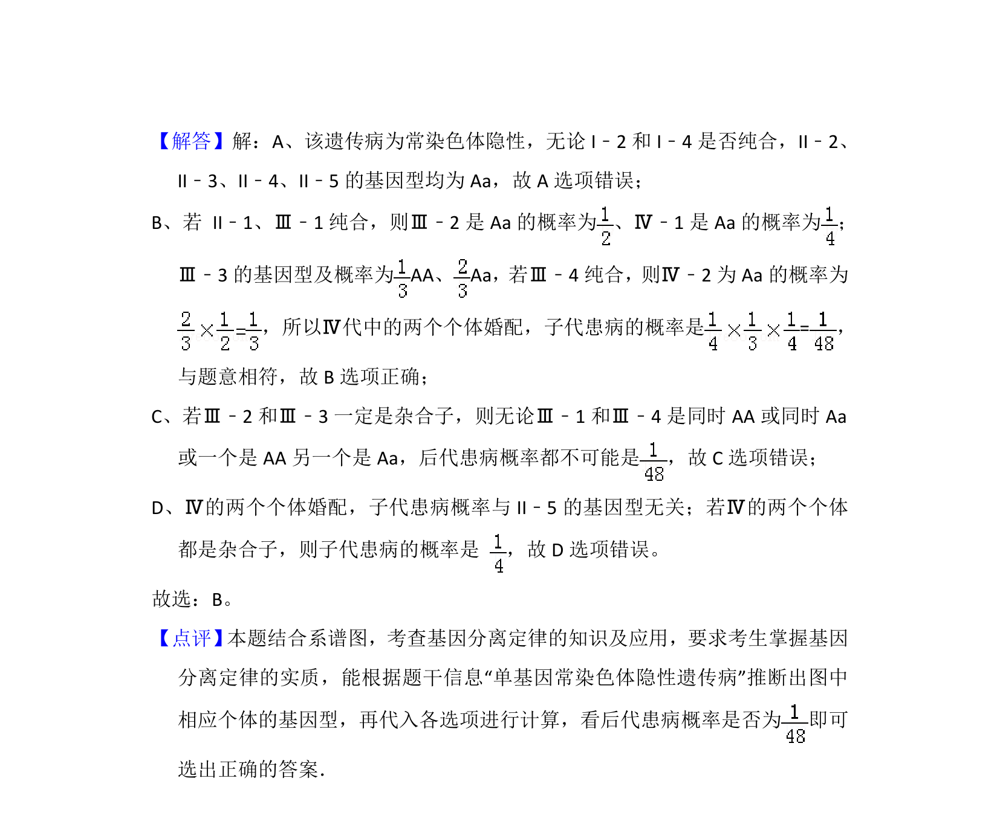

## 题面

## 摘要

考查单基因常染色体隐性遗传病系谱图分析及遗传概率计算条件限定。

## 关联考点

- [[常见的人类遗传病]]
- [[516-遗传系谱图分析|遗传系谱图分析]]
- [[948-概率计算|概率计算]]
- [[条件限定]]

## 答案与解析

> 📄 原 PDF 第 4 页：`素材/真题/湖南/2008-2024·（湖南）生物高考真题/2014年高考生物试卷（新课标Ⅰ）（解析卷）.pdf`

<!-- 题干文本-start -->
## 题干文本
5． （6分）如图为某种单基因常染色体隐性遗传病的系谱图（深色代表的个体是
该遗传病患者，其余为表现型正常个体） ．近亲结婚时该遗传病发病率较高，
假定图中第Ⅳ代的两个个体婚配生出一个患有该遗传病子代的概率是 ，那
么，得出此概率值需要的限定条件是（　　）
A．Ⅰ﹣2和Ⅰ﹣4必须是纯合子
B．Ⅱ﹣1、Ⅲ﹣1和Ⅲ﹣4必须是纯合子
C．Ⅱ﹣2、Ⅱ﹣3、Ⅲ﹣2和Ⅲ﹣3必须是杂合子
D．Ⅱ﹣4、Ⅱ﹣5、Ⅳ﹣1和Ⅳ﹣2必须是杂合子
<!-- 题干文本-end -->

<!-- 解析文本-start -->
## 解析文本
【考点】1W：真题集萃；A4：常见的人类遗传病．菁优网版权所有
【分析】分析系谱图：图示为某种单基因常染色体隐性遗传病的系谱图（用A、
a表示） ，则Ⅰ﹣1和Ⅰ﹣3的基因型均为aa，Ⅱ﹣2、Ⅱ﹣3、Ⅱ﹣4、Ⅱ﹣5
的基因型均为Aa，Ⅲ﹣3的基因型及概率为AA、Aa．据此答题．
<!-- 解析文本-end -->
