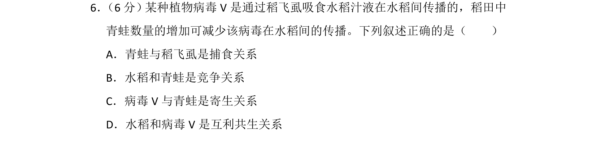
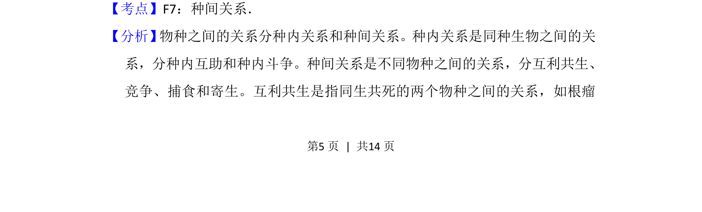
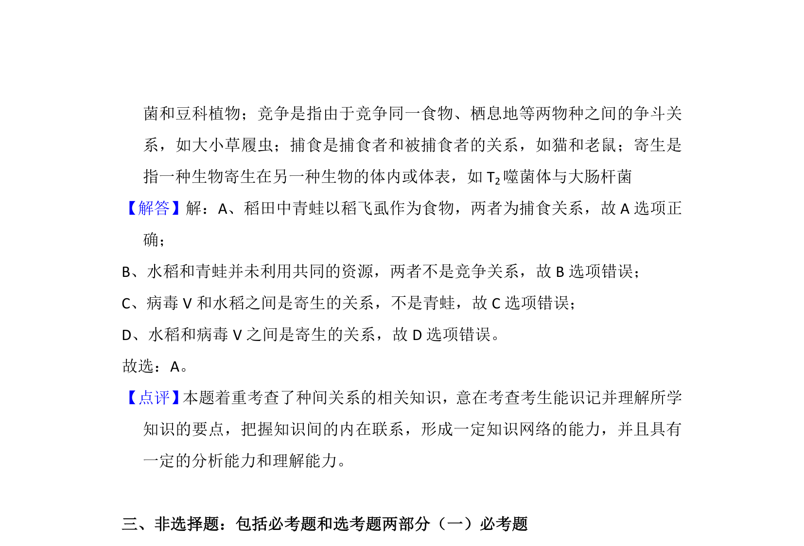

## 题面

## 摘要

本题通过水稻、稻飞虱、青蛙和植物病毒V的关系考查种间关系类型的判断。

## 关联考点

- [[022-生物因素|种间关系]]
- [[406-捕食|捕食]]
- [[405-寄生|寄生]]

## 答案与解析

> 📄 原 PDF 第 5 页：`素材/真题/湖南/2008-2024·（湖南）生物高考真题/2014年高考生物试卷（新课标Ⅰ）（解析卷）.pdf`
