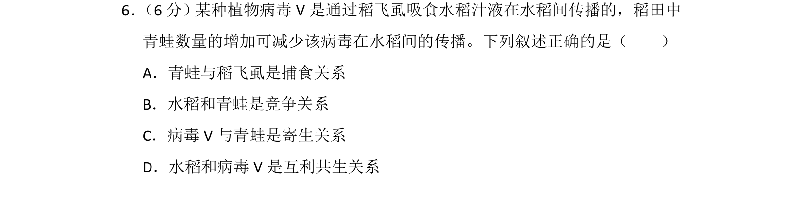
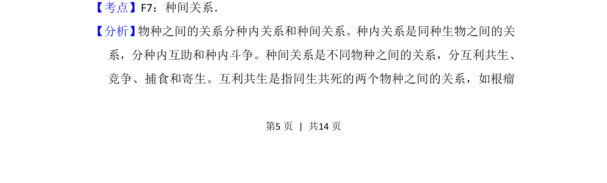
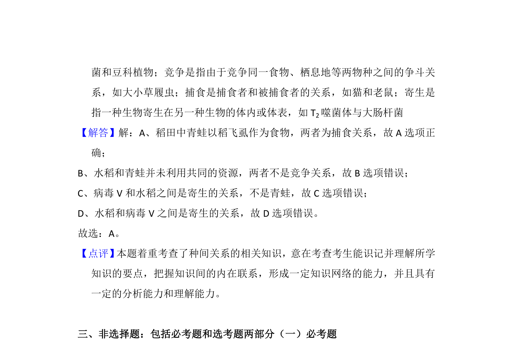

## 题面

## 摘要

本题通过水稻、稻飞虱、青蛙和植物病毒V的关系考查种间关系类型的判断。

## 关联考点

- [[022-生物因素|种间关系]]
- [[406-捕食|捕食]]
- [[405-寄生|寄生]]

## 答案与解析

> 📄 原 PDF 第 5 页：`素材/真题/湖南/2008-2024·（湖南）生物高考真题/2014年高考生物试卷（新课标Ⅰ）（解析卷）.pdf`

<!-- 题干文本-start -->
## 题干文本
6． （6分）某种植物病毒V是通过稻飞虱吸食水稻汁液在水稻间传播的，稻田中
青蛙数量的增加可减少该病毒在水稻间的传播。下列叙述正确的是（　　）
A．青蛙与稻飞虱是捕食关系
B．水稻和青蛙是竞争关系
C．病毒V与青蛙是寄生关系
D．水稻和病毒V是互利共生关系
<!-- 题干文本-end -->

<!-- 解析文本-start -->
## 解析文本
【考点】F7：种间关系．菁优网版权所有
【分析】 物种之间的关系分种内关系和种间关系。种内关系是同种生物之间的关
系，分种内互助和种内斗争。种间关系是不同物种之间的关系，分互利共生、
竞争、捕食和寄生。互利共生是指同生共死的两个物种之间的关系，如根瘤
<!-- 解析文本-end -->
