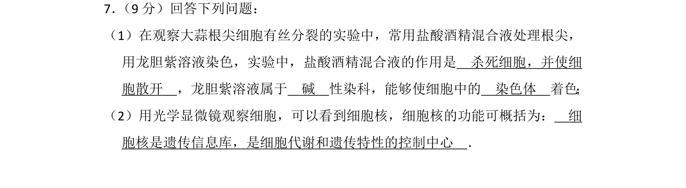
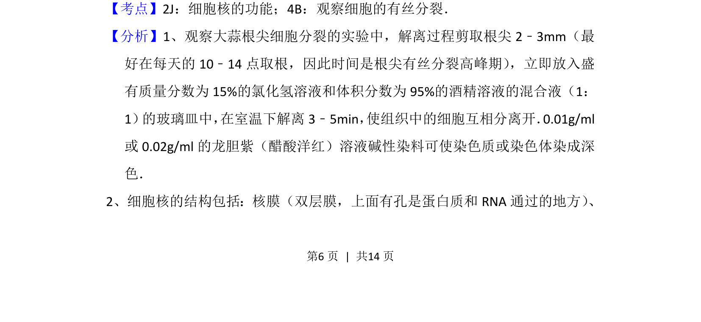
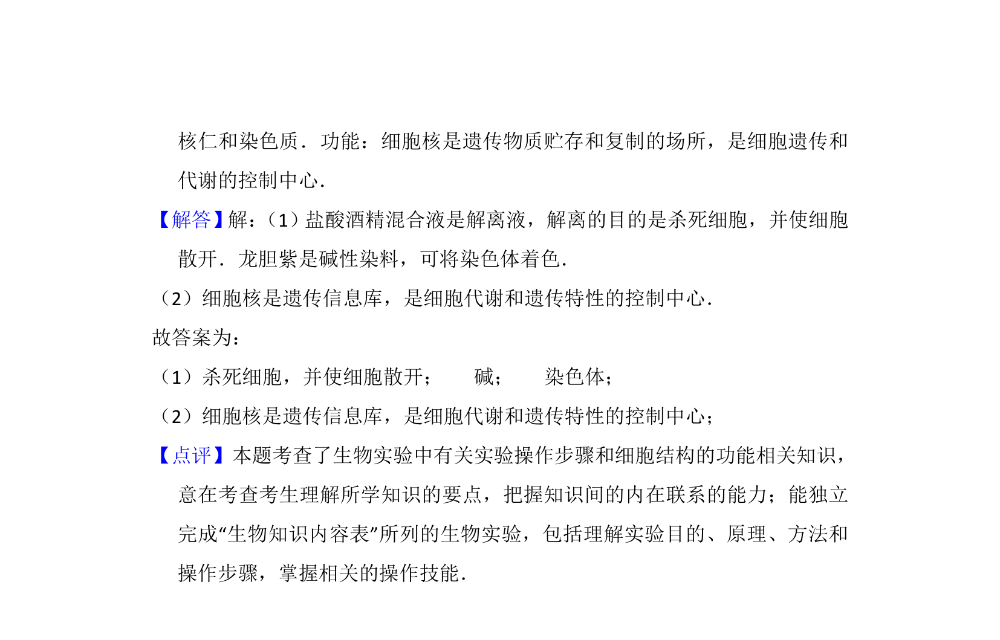

## 题面

## 摘要

观察大蒜根尖有丝分裂实验步骤与细胞核功能描记

## 关联考点

- [[细胞核的功能]]
- [[902-观察细胞的有丝分裂|观察细胞的有丝分裂]]

## 答案与解析

> 📄 原 PDF 第 6 页：`素材/真题/湖南/2008-2024·（湖南）生物高考真题/2014年高考生物试卷（新课标Ⅰ）（解析卷）.pdf`

<!-- 题干文本-start -->
## 题干文本
7． （9分）回答下列问题：
（1）在观察大蒜根尖细胞有丝分裂的实验中，常用盐酸酒精混合液处理根尖，
用龙胆紫溶液染色，实验中，盐酸酒精混合液的作用是　杀死细胞，并使细
胞散开　，龙胆紫溶液属于　碱　性染科，能够使细胞中的　染色体　着色；
（2）用光学显微镜观察细胞，可以看到细胞核，细胞核的功能可概括为：　细
胞核是遗传信息库，是细胞代谢和遗传特性的控制中心　．
<!-- 题干文本-end -->

<!-- 解析文本-start -->
## 解析文本
【考点】2J：细胞核的功能；4B：观察细胞的有丝分裂．菁优网版权所有
【分析】1、观察大蒜根尖细胞分裂的实验中，解离过程剪取根尖2﹣3mm（最
好在每天的10﹣14点取根，因此时间是根尖有丝分裂高峰期） ，立即放入盛
有质量分数为15%的氯化氢溶液和体积分数为95%的酒精溶液的混合液（1：
1） 的玻璃皿中， 在室温下解离3﹣5min， 使组织中的细胞互相分离开．0.01g/ml
或0.02g/ml的龙胆紫（醋酸洋红）溶液碱性染料可使染色质或染色体染成深
色．
2、细胞核的结构包括：核膜（双层膜，上面有孔是蛋白质和RNA通过的地方） 、
<!-- 解析文本-end -->
