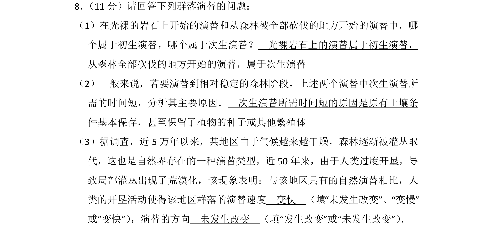
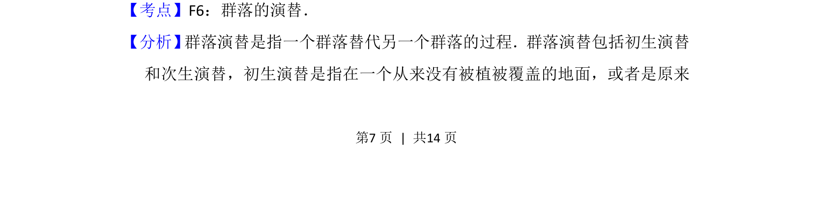
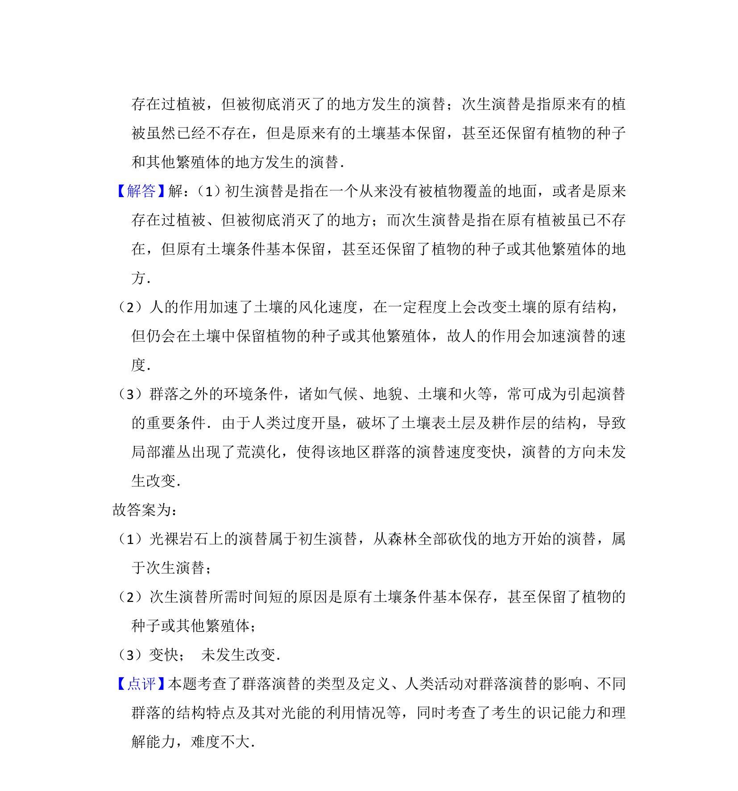

## 题面

## 摘要

该题考查群落演替类型的判断、次生演替所需时间短的原因，以及人类活动对演替速度和方向的影响。

## 关联考点

- [[920-群落的演替|群落的演替]]
- [[初生演替]]
- [[917-次生演替|次生演替]]

## 答案与解析

> 📄 原 PDF 第 7 页：`素材/真题/湖南/2008-2024·（湖南）生物高考真题/2014年高考生物试卷（新课标Ⅰ）（解析卷）.pdf`
