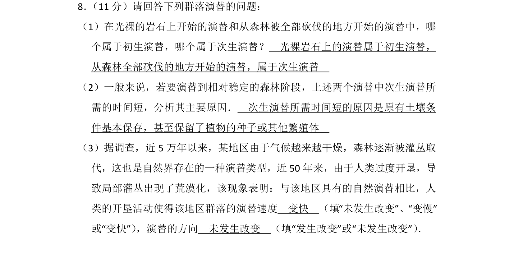
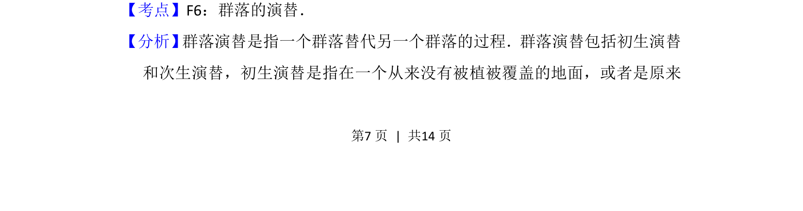
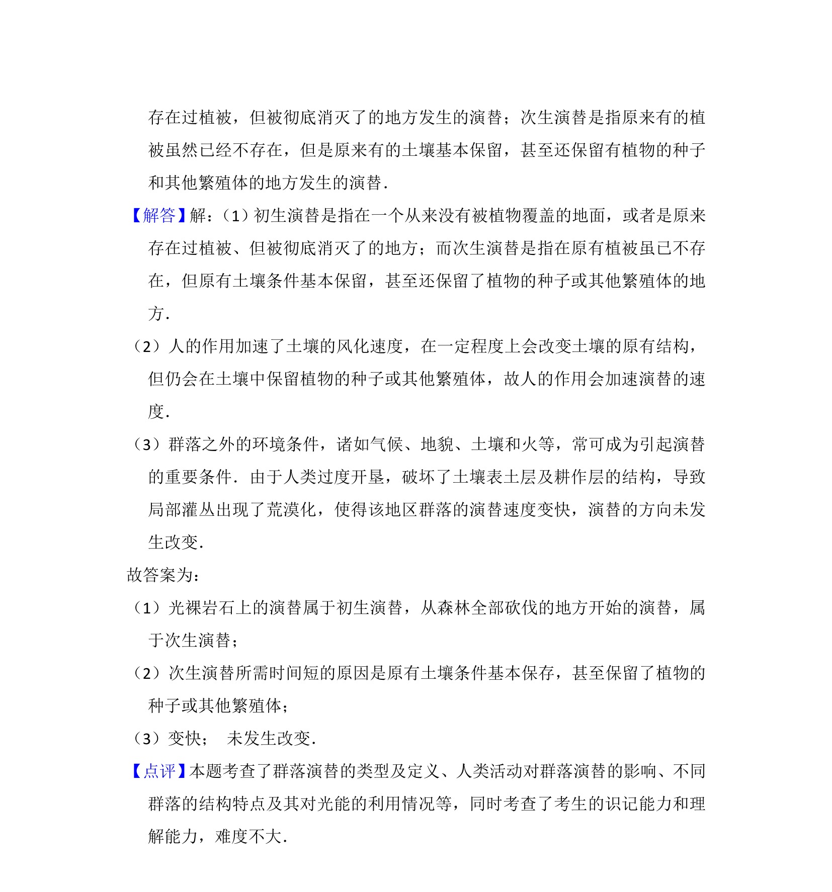

## 题面

## 摘要

该题考查群落演替类型的判断、次生演替所需时间短的原因，以及人类活动对演替速度和方向的影响。

## 关联考点

- [[407-群落演替|群落的演替]]
- [[初生演替]]
- [[917-次生演替|次生演替]]

## 答案与解析

> 📄 原 PDF 第 7 页：`素材/真题/湖南/2008-2024·（湖南）生物高考真题/2014年高考生物试卷（新课标Ⅰ）（解析卷）.pdf`

<!-- 题干文本-start -->
## 题干文本
8． （11分）请回答下列群落演替的问题：
（1）在光裸的岩石上开始的演替和从森林被全部砍伐的地方开始的演替中，哪
个属于初生演替，哪个属于次生演替？　光裸岩石上的演替属于初生演替，
从森林全部砍伐的地方开始的演替，属于次生演替　
（2）一般来说，若要演替到相对稳定的森林阶段，上述两个演替中次生演替所
需的时间短，分析其主要原因．　次生演替所需时间短的原因是原有土壤条
件基本保存，甚至保留了植物的种子或其他繁殖体　
（3）据调查，近5万年以来，某地区由于气候越来越干燥，森林逐渐被灌丛取
代，这也是自然界存在的一种演替类型，近50年来，由于人类过度开垦，导
致局部灌丛出现了荒漠化，该现象表明：与该地区具有的自然演替相比，人
类的开垦活动使得该地区群落的演替速度　变快　（填“未发生改变”、“变慢”
或“变快”） ，演替的方向　未发生改变　（填“发生改变”或“未发生改变”） ．
<!-- 题干文本-end -->

<!-- 解析文本-start -->
## 解析文本
【考点】F6：群落的演替．菁优网版权所有
【分析】 群落演替是指一个群落替代另一个群落的过程．群落演替包括初生演替
和次生演替，初生演替是指在一个从来没有被植被覆盖的地面，或者是原来
<!-- 解析文本-end -->
