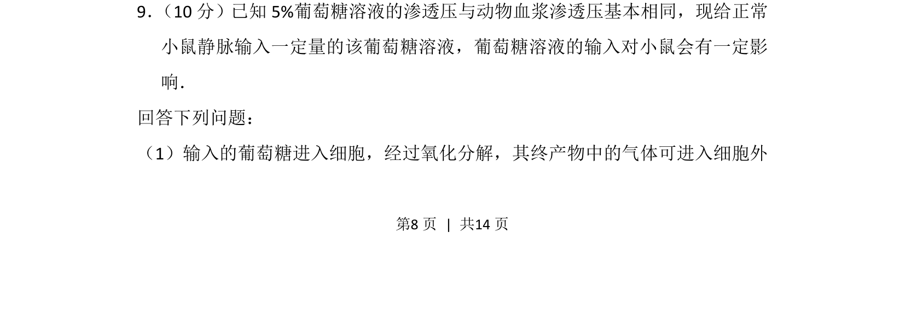
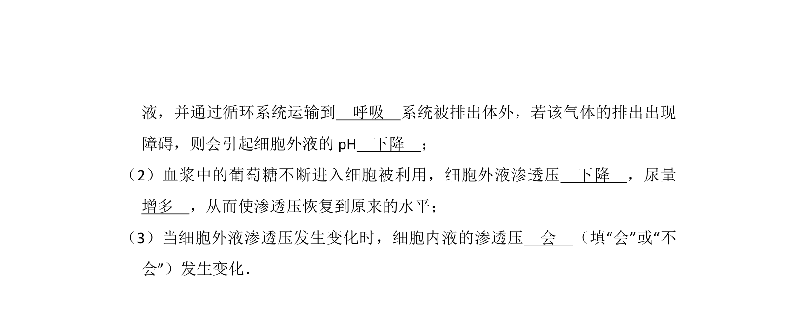
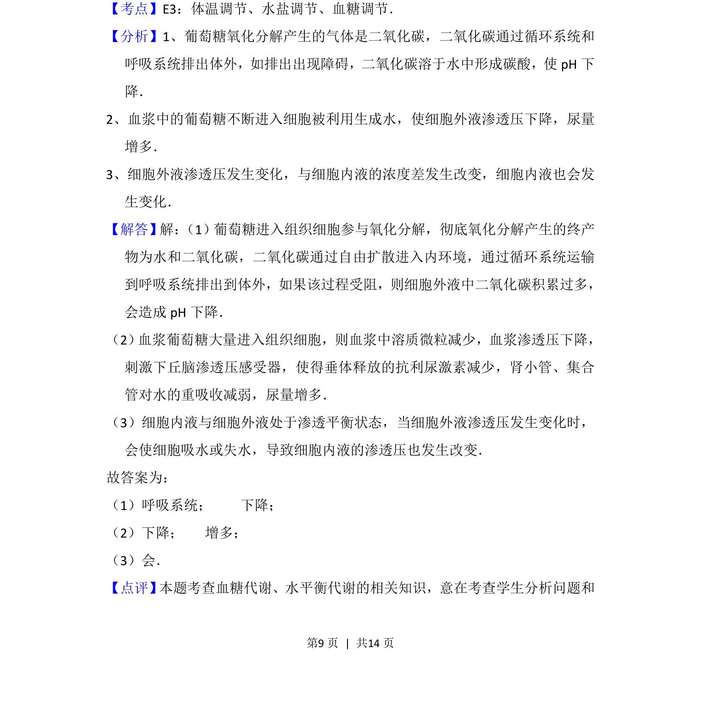

## 题面

## 摘要

输入葡萄糖溶液对小鼠生理影响，考查细胞呼吸产物及运输

## 关联考点

- [[241-细胞呼吸|细胞呼吸]]
- [[气体运输]]
- [[314-内环境稳态|内环境稳态]]

## 答案与解析

> 📄 原 PDF 第 8 页：`素材/真题/湖南/2008-2024·（湖南）生物高考真题/2014年高考生物试卷（新课标Ⅰ）（解析卷）.pdf`

<!-- 题干文本-start -->
## 题干文本
9． （10分）已知5%葡萄糖溶液的渗透压与动物血浆渗透压基本相同，现给正常
小鼠静脉输入一定量的该葡萄糖溶液，葡萄糖溶液的输入对小鼠会有一定影
响．
回答下列问题：
（1）输入的葡萄糖进入细胞，经过氧化分解，其终产物中的气体可进入细胞外
<!-- 题干文本-end -->

<!-- 解析文本-start -->
## 解析文本

<!-- 解析文本-end -->
