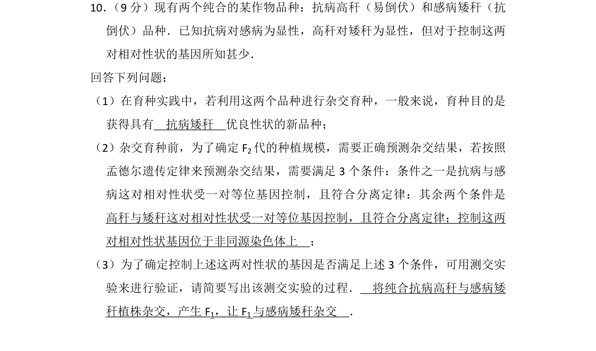
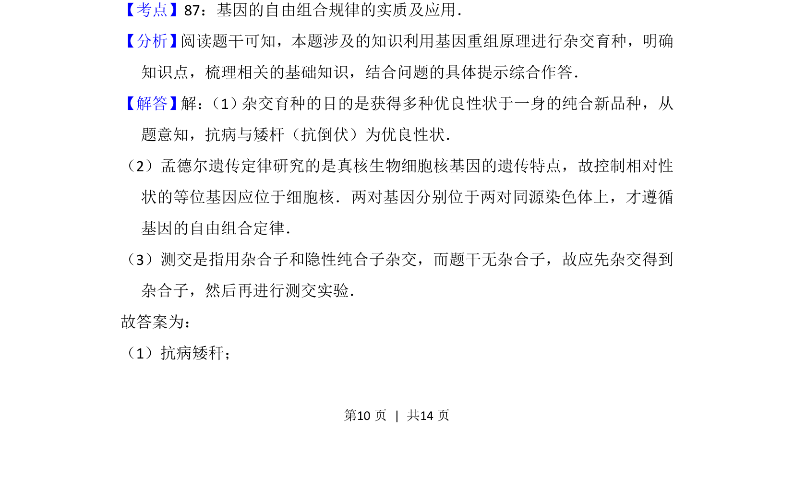
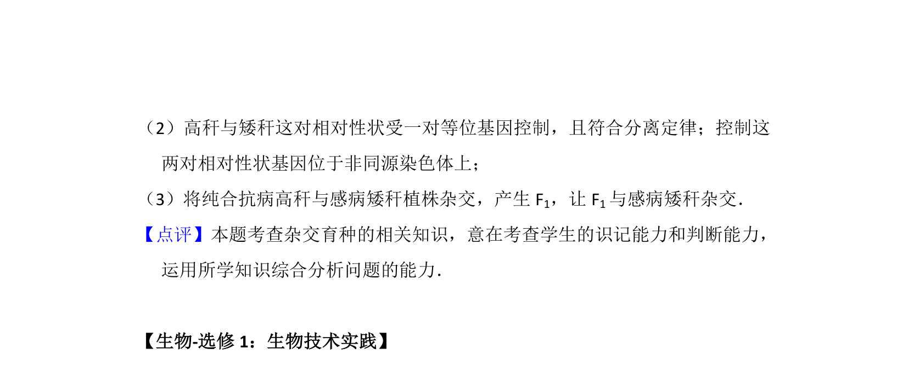

## 题面

## 摘要

杂交育种中利用基因自由组合定律获得优良性状及测交验证。

## 关联考点

- [[580-基因自由组合定律|基因自由组合定律]]
- [[493-杂交育种|杂交育种]]
- [[测交验证]]

## 答案与解析

> 📄 原 PDF 第 10 页：`素材/真题/湖南/2008-2024·（湖南）生物高考真题/2014年高考生物试卷（新课标Ⅰ）（解析卷）.pdf`
