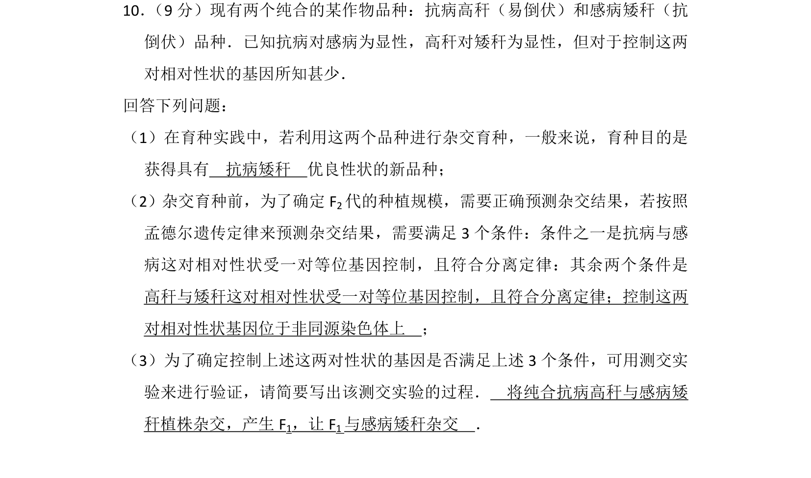
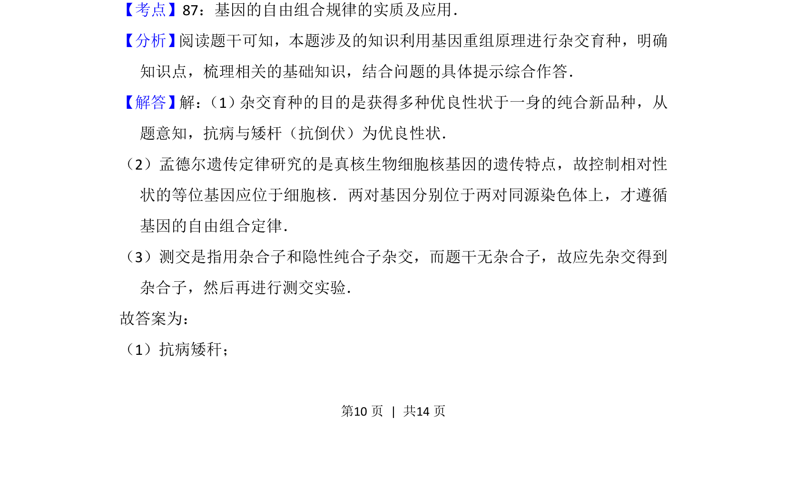
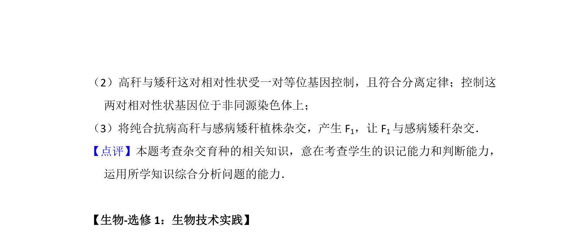

## 题面

## 摘要

杂交育种中利用基因自由组合定律获得优良性状及测交验证。

## 关联考点

- [[580-基因自由组合定律|基因自由组合定律]]
- [[493-杂交育种|杂交育种]]
- [[测交验证]]

## 答案与解析

> 📄 原 PDF 第 10 页：`素材/真题/湖南/2008-2024·（湖南）生物高考真题/2014年高考生物试卷（新课标Ⅰ）（解析卷）.pdf`

<!-- 题干文本-start -->
## 题干文本
10． （9分）现有两个纯合的某作物品种：抗病高秆（易倒伏）和感病矮秆（抗
倒伏）品种．已知抗病对感病为显性，高秆对矮秆为显性，但对于控制这两
对相对性状的基因所知甚少．
回答下列问题：
（1）在育种实践中，若利用这两个品种进行杂交育种，一般来说，育种目的是
获得具有　抗病矮秆　优良性状的新品种；
（2）杂交育种前，为了确定F 2代的种植规模，需要正确预测杂交结果，若按照
孟德尔遗传定律来预测杂交结果，需要满足3个条件：条件之一是抗病与感
病这对相对性状受一对等位基因控制，且符合分离定律：其余两个条件是　
高秆与矮秆这对相对性状受一对等位基因控制，且符合分离定律；控制这两
对相对性状基因位于非同源染色体上　；
（3）为了确定控制上述这两对性状的基因是否满足上述3个条件，可用测交实
验来进行验证，请简要写出该测交实验的过程．　将纯合抗病高秆与感病矮
秆植株杂交，产生F 1，让F 1与感病矮秆杂交　．
<!-- 题干文本-end -->

<!-- 解析文本-start -->
## 解析文本
【考点】87：基因的自由组合规律的实质及应用．菁优网版权所有
【分析】 阅读题干可知，本题涉及的知识利用基因重组原理进行杂交育种，明确
知识点，梳理相关的基础知识，结合问题的具体提示综合作答．
【解答】解： （1）杂交育种的目的是获得多种优良性状于一身的纯合新品种，从
题意知，抗病与矮杆（抗倒伏）为优良性状．  
（2）孟德尔遗传定律研究的是真核生物细胞核基因的遗传特点，故控制相对性
状的等位基因应位于细胞核．两对基因分别位于两对同源染色体上，才遵循
基因的自由组合定律．  
（3）测交是指用杂合子和隐性纯合子杂交，而题干无杂合子，故应先杂交得到
杂合子，然后再进行测交实验．
故答案为：
（1）抗病矮秆；
<!-- 解析文本-end -->
