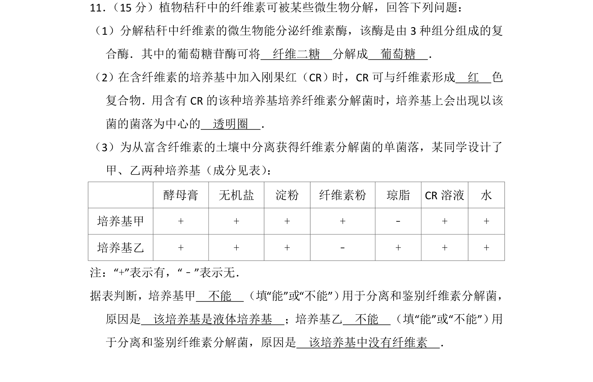
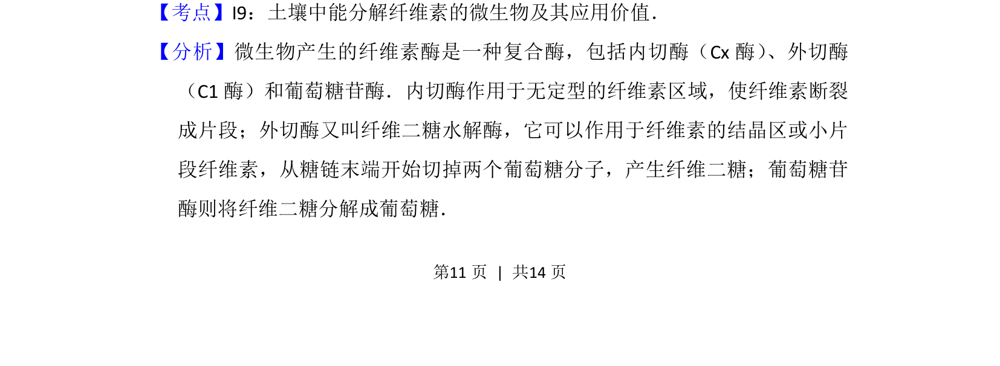
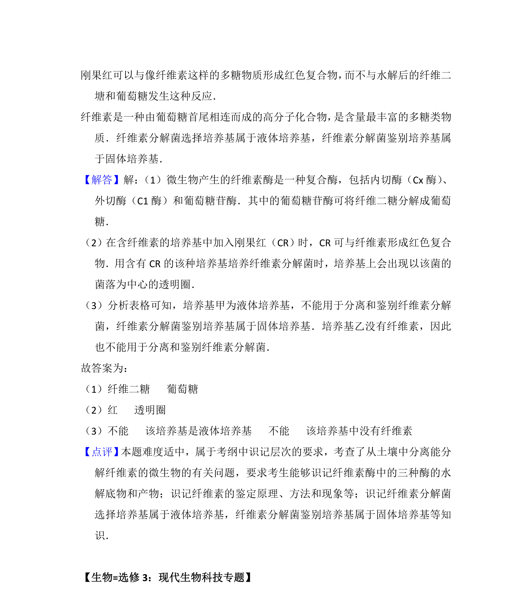

## 题面

## 摘要

该题考查微生物分解纤维素的酶系组成、刚果红染色原理及选择培养基的设计与分析。

## 关联考点

- [[纤维素酶]]
- [[刚果红染色法]]
- [[纤维素分解菌的分离]]
- [[427-培养基|选择培养基]]

## 答案与解析

> 📄 原 PDF 第 11 页：`素材/真题/湖南/2008-2024·（湖南）生物高考真题/2014年高考生物试卷（新课标Ⅰ）（解析卷）.pdf`
