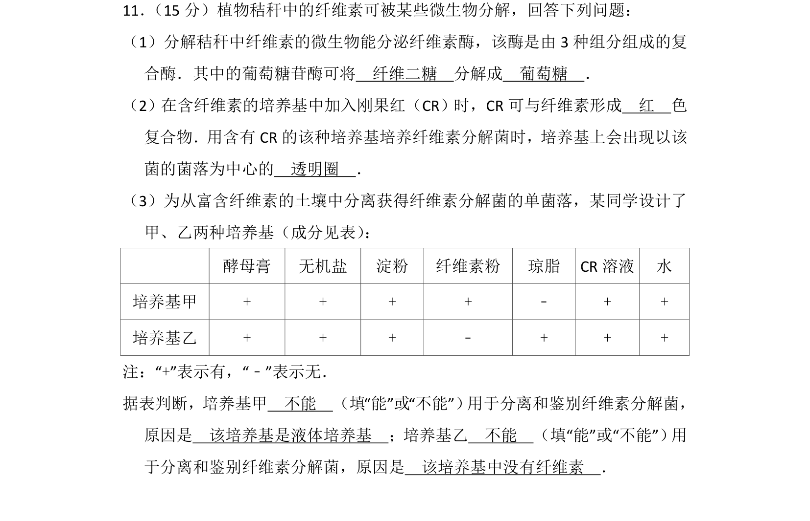
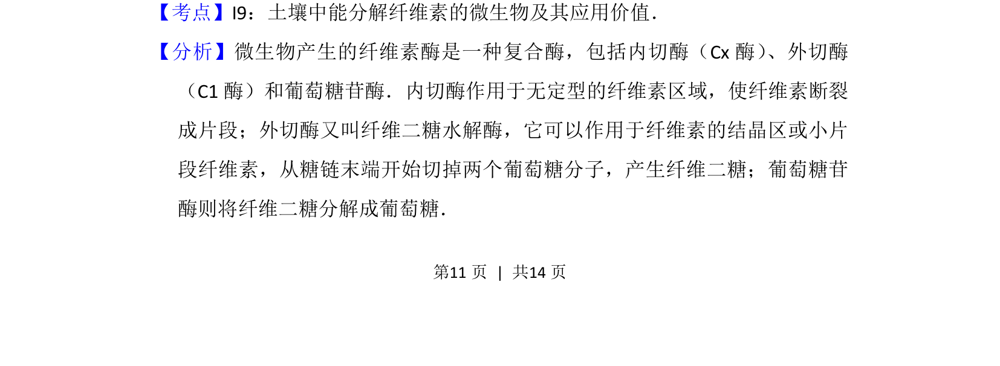
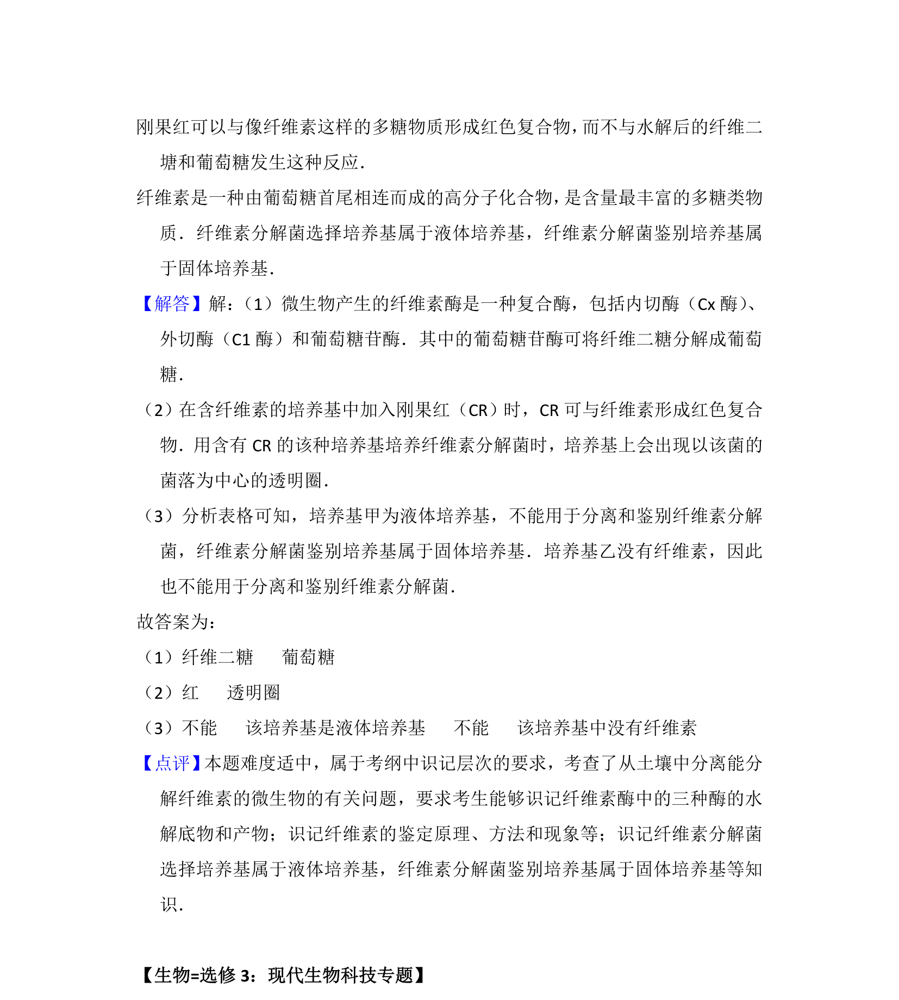

## 题面

## 摘要

该题考查微生物分解纤维素的酶系组成、刚果红染色原理及选择培养基的设计与分析。

## 关联考点

- [[912-纤维素酶|纤维素酶]]
- [[刚果红染色法]]
- [[纤维素分解菌的分离]]
- [[427-培养基|选择培养基]]

## 答案与解析

> 📄 原 PDF 第 11 页：`素材/真题/湖南/2008-2024·（湖南）生物高考真题/2014年高考生物试卷（新课标Ⅰ）（解析卷）.pdf`

<!-- 题干文本-start -->
## 题干文本
11． （15分）植物秸秆中的纤维素可被某些微生物分解，回答下列问题：
（1）分解秸秆中纤维素的微生物能分泌纤维素酶，该酶是由3种组分组成的复
合酶．其中的葡萄糖苷酶可将　纤维二糖　分解成　葡萄糖　．
（2）在含纤维素的培养基中加入刚果红（CR）时，CR可与纤维素形成　红　色
复合物．用含有CR的该种培养基培养纤维素分解菌时，培养基上会出现以该
菌的菌落为中心的　透明圈　．
（3）为从富含纤维素的土壤中分离获得纤维素分解菌的单菌落，某同学设计了
甲、乙两种培养基（成分见表） ：
酵母膏 无机盐 淀粉 纤维素粉 琼脂 CR溶液 水
培养基甲 + + + + ﹣ + +
培养基乙 + + + ﹣ + + +
注：“+”表示有，“﹣”表示无．
据表判断，培养基甲　不能　（填“能”或“不能”） 用于分离和鉴别纤维素分解菌，
原因是　该培养基是液体培养基　；培养基乙　不能　（填“能”或“不能”） 用
于分离和鉴别纤维素分解菌，原因是　该培养基中没有纤维素　．
<!-- 题干文本-end -->

<!-- 解析文本-start -->
## 解析文本
【考点】I9：土壤中能分解纤维素的微生物及其应用价值．菁优网版权所有
【分析】微生物产生的纤维素酶是一种复合酶，包括内切酶（Cx酶） 、外切酶
（C1酶）和葡萄糖苷酶．内切酶作用于无定型的纤维素区域，使纤维素断裂
成片段；外切酶又叫纤维二糖水解酶，它可以作用于纤维素的结晶区或小片
段纤维素，从糖链末端开始切掉两个葡萄糖分子，产生纤维二糖；葡萄糖苷
酶则将纤维二糖分解成葡萄糖．
<!-- 解析文本-end -->
