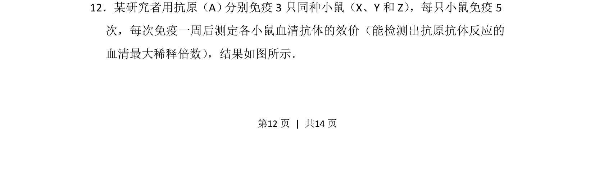
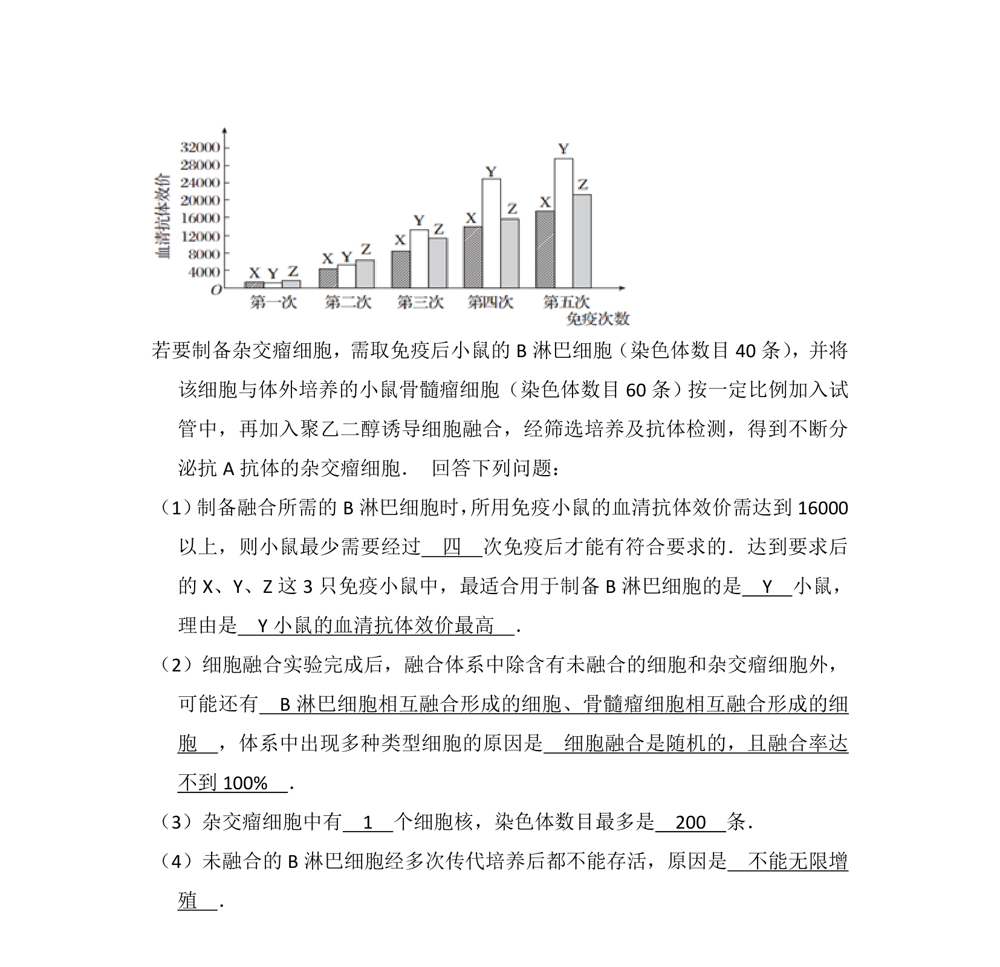
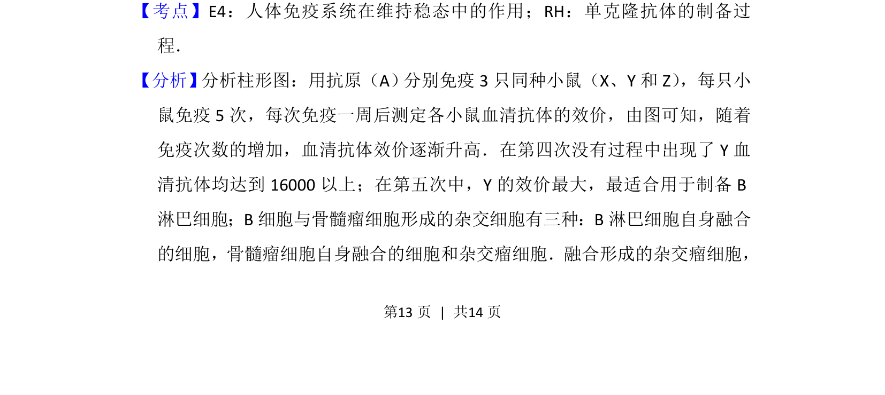
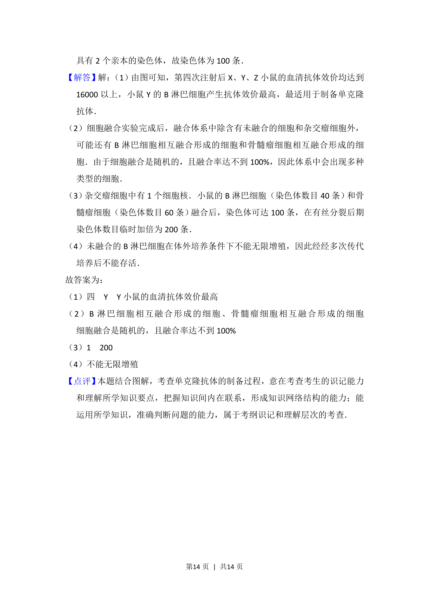

## 题面

## 摘要

三次免疫后抗体效价变化分析，考查体液免疫应答规律与实验数据解读。

## 关联考点

- [[163-抗原|抗原]]
- [[162-抗体|抗体]]
- [[353-体液免疫|体液免疫]]
- [[效价]]

## 答案与解析

> 📄 原 PDF 第 12 页：`素材/真题/湖南/2008-2024·（湖南）生物高考真题/2014年高考生物试卷（新课标Ⅰ）（解析卷）.pdf`
