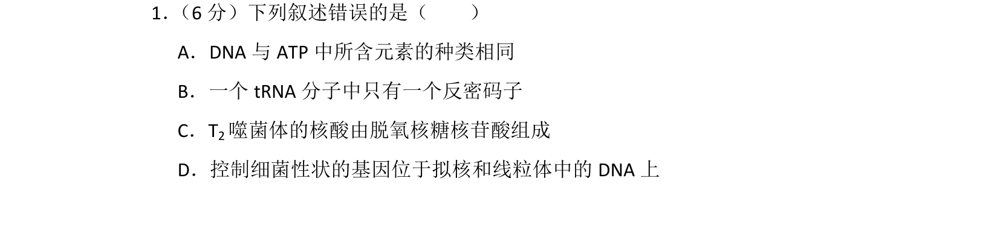
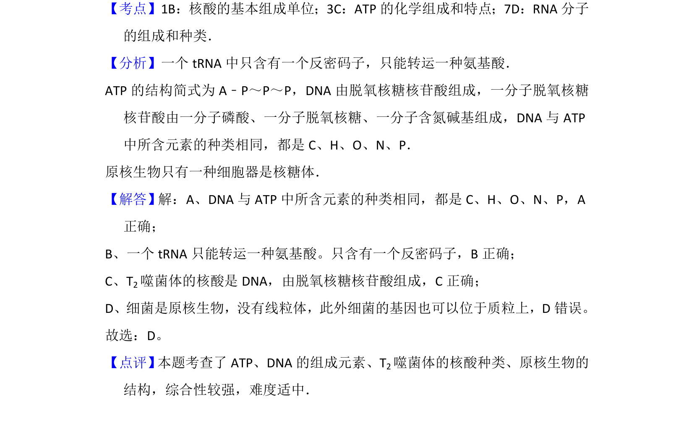

## 题面

## 摘要

本题考查组成细胞的化合物、核酸种类及原核细胞结构，通过判断叙述正误进行综合考查。

## 关联考点

- [[核酸组成元素]]
- [[ATP结构]]
- [[原核细胞结构]]

## 答案与解析

> 📄 原 PDF 第 1 页：`素材/真题/湖南/2008-2024·（湖南）生物高考真题/2015年高考生物试卷（新课标Ⅰ）（解析卷）.pdf`

<!-- 题干文本-start -->
## 题干文本
1． （6分）下列叙述错误的是（　　）
A．DNA与ATP中所含元素的种类相同
B．一个tRNA分子中只有一个反密码子
C．T2噬菌体的核酸由脱氧核糖核苷酸组成
D．控制细菌性状的基因位于拟核和线粒体中的DNA上
<!-- 题干文本-end -->

<!-- 解析文本-start -->
## 解析文本
【考点】1B：核酸的基本组成单位；3C：ATP的化学组成和特点；7D：RNA分子
的组成和种类．菁优网版权所有
【分析】一个tRNA中只含有一个反密码子，只能转运一种氨基酸．
ATP的结构简式为A﹣P～P～P，DNA由脱氧核糖核苷酸组成，一分子脱氧核糖
核苷酸由一分子磷酸、一分子脱氧核糖、一分子含氮碱基组成，DNA与ATP
中所含元素的种类相同，都是C、H、O、N、P．
原核生物只有一种细胞器是核糖体．
【解答】解：A、DNA与ATP中所含元素的种类相同，都是C、H、O、N、P，A
正确；
B、一个tRNA只能转运一种氨基酸。只含有一个反密码子，B正确；
C、T2噬菌体的核酸是DNA，由脱氧核糖核苷酸组成，C正确；
D、细菌是原核生物，没有线粒体，此外细菌的基因也可以位于质粒上，D错误。
故选：D。
【点评】 本题考查了ATP、DNA的组成元素、T2噬菌体的核酸种类、原核生物的
结构，综合性较强，难度适中．
<!-- 解析文本-end -->
