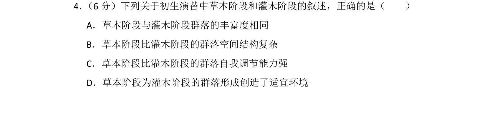
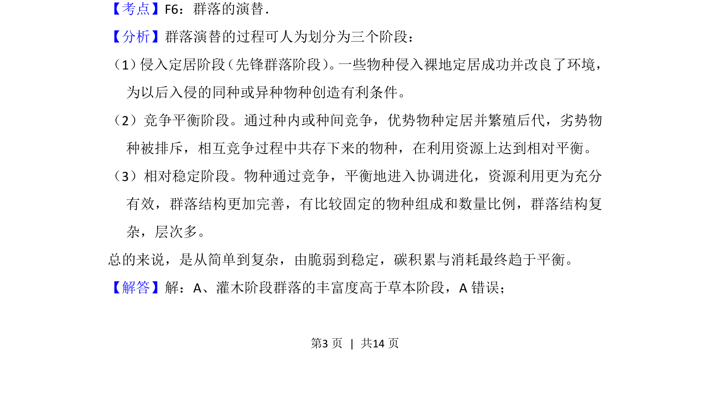
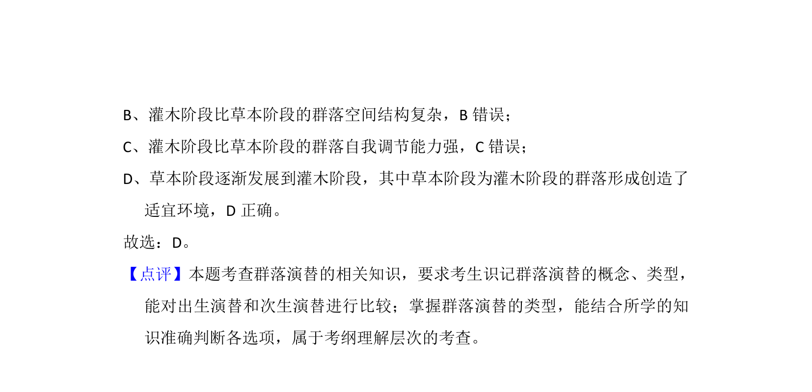

## 题面

## 摘要

初生演替中草本阶段与灌木阶段的群落特征比较

## 关联考点

- [[920-群落的演替|群落的演替]]
- [[911-丰富度|丰富度]]
- [[378-群落空间结构|群落空间结构]]
- [[自我调节能力]]

## 答案与解析

> 📄 原 PDF 第 3 页：`素材/真题/湖南/2008-2024·（湖南）生物高考真题/2015年高考生物试卷（新课标Ⅰ）（解析卷）.pdf`
