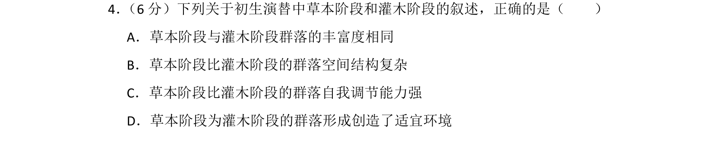
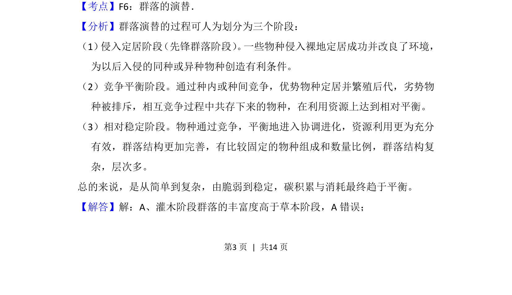
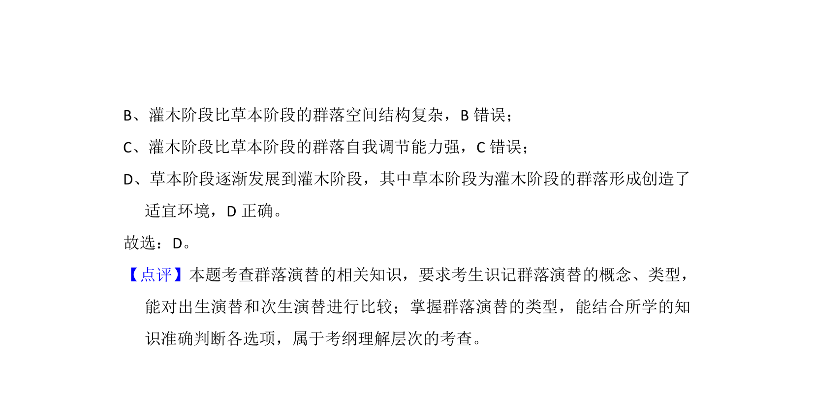

## 题面

## 摘要

初生演替中草本阶段与灌木阶段的群落特征比较

## 关联考点

- [[407-群落演替|群落的演替]]
- [[911-丰富度|丰富度]]
- [[378-群落空间结构|群落空间结构]]
- [[自我调节能力]]

## 答案与解析

> 📄 原 PDF 第 3 页：`素材/真题/湖南/2008-2024·（湖南）生物高考真题/2015年高考生物试卷（新课标Ⅰ）（解析卷）.pdf`

<!-- 题干文本-start -->
## 题干文本
4． （6分）下列关于初生演替中草本阶段和灌木阶段的叙述，正确的是（　　）
A．草本阶段与灌木阶段群落的丰富度相同
B．草本阶段比灌木阶段的群落空间结构复杂
C．草本阶段比灌木阶段的群落自我调节能力强
D．草本阶段为灌木阶段的群落形成创造了适宜环境
<!-- 题干文本-end -->

<!-- 解析文本-start -->
## 解析文本
【考点】F6：群落的演替．菁优网版权所有
【分析】群落演替的过程可人为划分为三个阶段：
（1） 侵入定居阶段 （先锋群落阶段） 。 一些物种侵入裸地定居成功并改良了环境，
为以后入侵的同种或异种物种创造有利条件。
（2）竞争平衡阶段。通过种内或种间竞争，优势物种定居并繁殖后代，劣势物
种被排斥，相互竞争过程中共存下来的物种，在利用资源上达到相对平衡。
（3）相对稳定阶段。物种通过竞争，平衡地进入协调进化，资源利用更为充分
有效，群落结构更加完善，有比较固定的物种组成和数量比例，群落结构复
杂，层次多。
总的来说，是从简单到复杂，由脆弱到稳定，碳积累与消耗最终趋于平衡。
【解答】解：A、灌木阶段群落的丰富度高于草本阶段，A错误；
<!-- 解析文本-end -->
