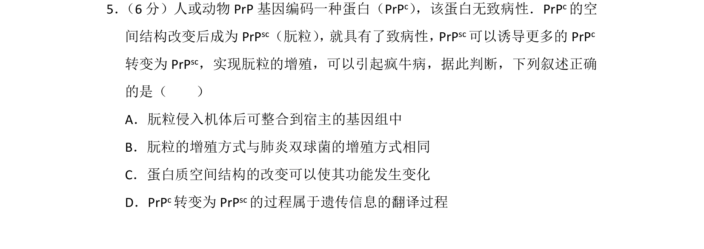
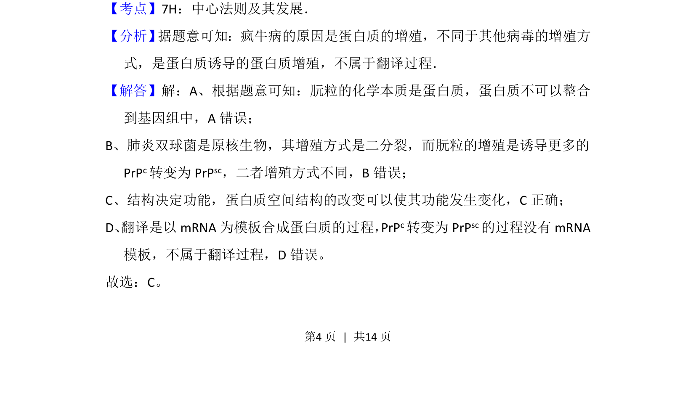
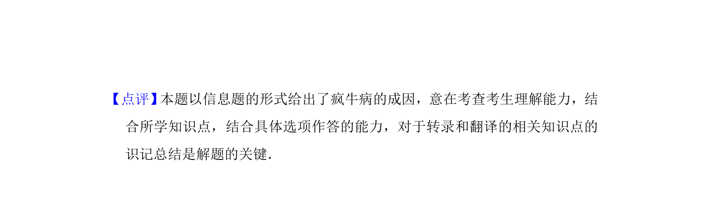

## 题面

## 摘要

朊粒通过蛋白质结构改变实现增殖，考查蛋白质结构功能关系与中心法则的辨析。

## 关联考点

- [[923-蛋白质结构|蛋白质结构]]
- [[696-蛋白质功能|蛋白质功能]]
- [[朊粒增殖]]
- [[295-中心法则|中心法则]]

## 答案与解析

> 📄 原 PDF 第 4 页：`素材/真题/湖南/2008-2024·（湖南）生物高考真题/2015年高考生物试卷（新课标Ⅰ）（解析卷）.pdf`
