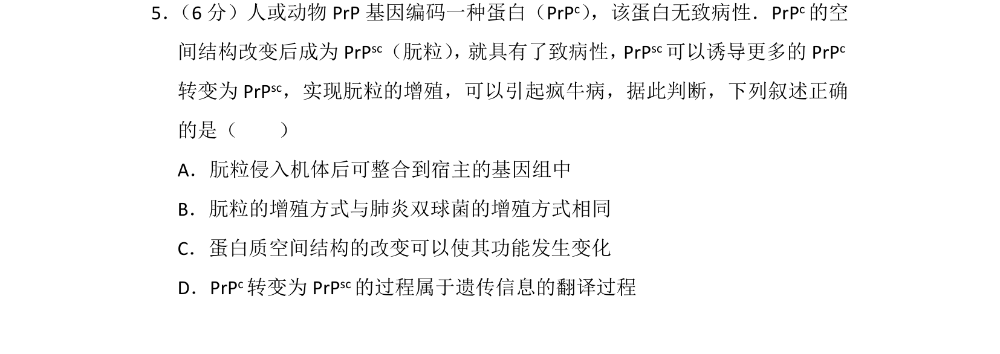
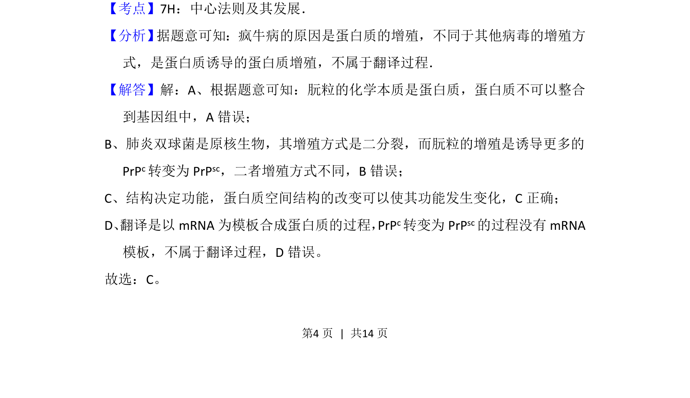
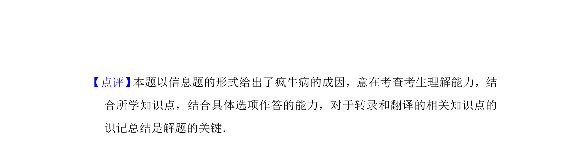

## 题面

## 摘要

朊粒通过蛋白质结构改变实现增殖，考查蛋白质结构功能关系与中心法则的辨析。

## 关联考点

- [[923-蛋白质结构|蛋白质结构]]
- [[696-蛋白质功能|蛋白质功能]]
- [[朊粒增殖]]
- [[295-中心法则|中心法则]]

## 答案与解析

> 📄 原 PDF 第 4 页：`素材/真题/湖南/2008-2024·（湖南）生物高考真题/2015年高考生物试卷（新课标Ⅰ）（解析卷）.pdf`

<!-- 题干文本-start -->
## 题干文本
5． （6分）人或动物PrP基因编码一种蛋白（PrPc） ，该蛋白无致病性．PrPc的空
间结构改变后成为PrP sc（朊粒） ， 就具有了致病性，PrPsc可以诱导更多的PrP c
转变为PrP sc，实现朊粒的增殖，可以引起疯牛病，据此判断，下列叙述正确
的是（　　）
A．朊粒侵入机体后可整合到宿主的基因组中
B．朊粒的增殖方式与肺炎双球菌的增殖方式相同
C．蛋白质空间结构的改变可以使其功能发生变化
D．PrPc转变为PrP sc的过程属于遗传信息的翻译过程
<!-- 题干文本-end -->

<!-- 解析文本-start -->
## 解析文本
【考点】7H：中心法则及其发展．菁优网版权所有
【分析】 据题意可知：疯牛病的原因是蛋白质的增殖，不同于其他病毒的增殖方
式，是蛋白质诱导的蛋白质增殖，不属于翻译过程．
【解答】解：A、根据题意可知：朊粒的化学本质是蛋白质，蛋白质不可以整合
到基因组中，A错误；
B、肺炎双球菌是原核生物，其增殖方式是二分裂，而朊粒的增殖是诱导更多的
PrPc转变为PrP sc，二者增殖方式不同，B错误；
C、结构决定功能，蛋白质空间结构的改变可以使其功能发生变化，C正确；
D、 翻译是以mRNA为模板合成蛋白质的过程，PrPc转变为PrP sc的过程没有mRNA
模板，不属于翻译过程，D错误。
故选：C。
<!-- 解析文本-end -->
