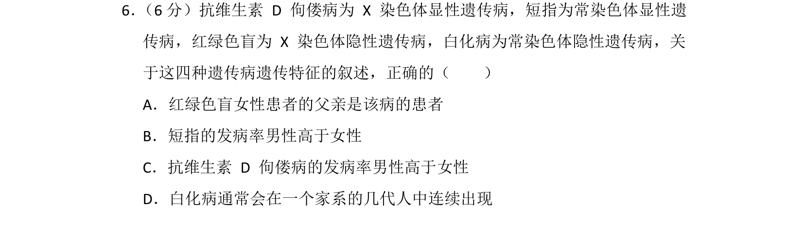
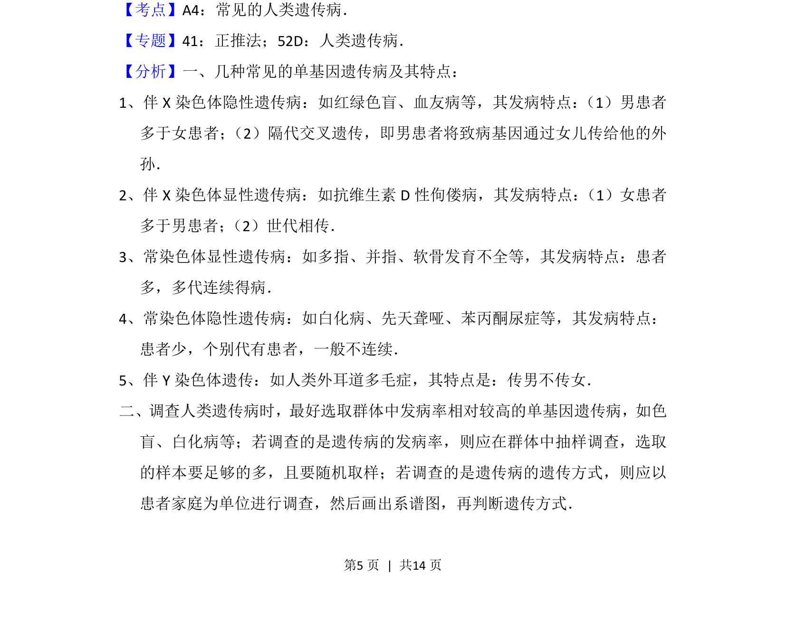
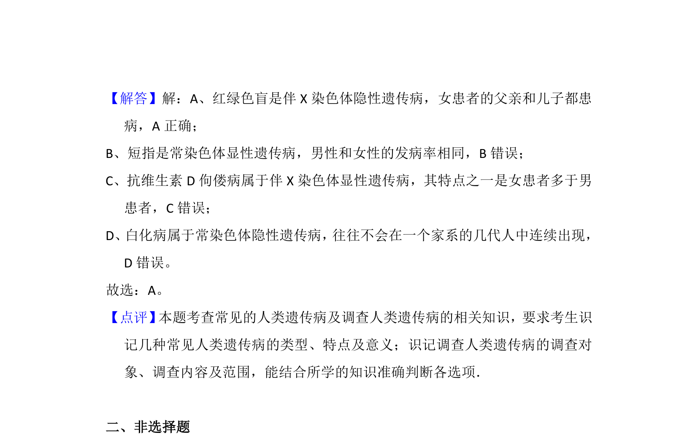

## 题面

## 摘要

本题通过抗维生素 D 佝偻病、短指等四种遗传病，考查其遗传特征的识别。

## 关联考点

- [[299-人类遗传病|人类遗传病]]
- [[伴X显性遗传]]
- [[802-伴X隐性遗传|伴X隐性遗传]]
- [[常染色体显/隐性遗传]]

## 答案与解析

> 📄 原 PDF 第 5 页：`素材/真题/湖南/2008-2024·（湖南）生物高考真题/2015年高考生物试卷（新课标Ⅰ）（解析卷）.pdf`
