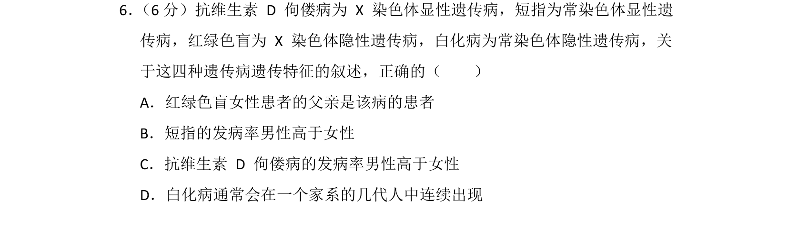
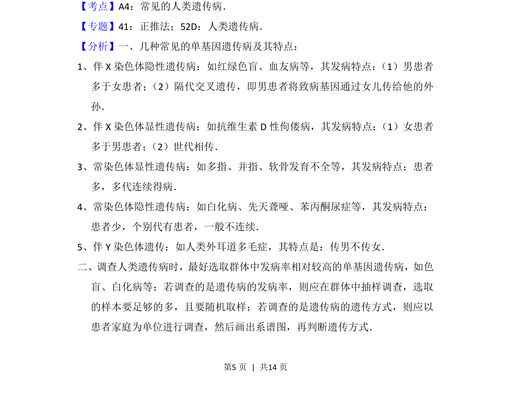
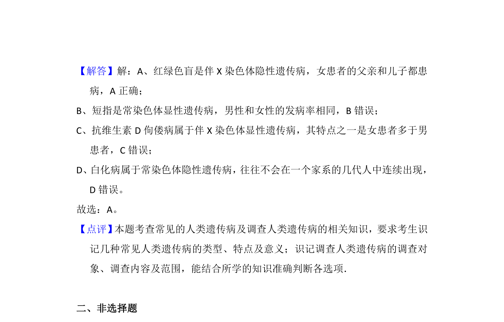

## 题面

## 摘要

本题通过抗维生素 D 佝偻病、短指等四种遗传病，考查其遗传特征的识别。

## 关联考点

- [[299-人类遗传病|人类遗传病]]
- [[伴X显性遗传]]
- [[802-伴X隐性遗传|伴X隐性遗传]]
- [[常染色体显/隐性遗传]]

## 答案与解析

> 📄 原 PDF 第 5 页：`素材/真题/湖南/2008-2024·（湖南）生物高考真题/2015年高考生物试卷（新课标Ⅰ）（解析卷）.pdf`

<!-- 题干文本-start -->
## 题干文本
6． （6分）抗维生素 D 佝偻病为 X 染色体显性遗传病，短指为常染色体显性遗
传病，红绿色盲为 X 染色体隐性遗传病，白化病为常染色体隐性遗传病，关
于这四种遗传病遗传特征的叙述，正确的（　　）
A．红绿色盲女性患者的父亲是该病的患者
B．短指的发病率男性高于女性
C．抗维生素 D 佝偻病的发病率男性高于女性
D．白化病通常会在一个家系的几代人中连续出现
<!-- 题干文本-end -->

<!-- 解析文本-start -->
## 解析文本
【考点】A4：常见的人类遗传病．菁优网版权所有
【专题】41：正推法；52D：人类遗传病．
【分析】一、几种常见的单基因遗传病及其特点：
1、伴X染色体隐性遗传病：如红绿色盲、血友病等，其发病特点： （1）男患者
多于女患者； （2）隔代交叉遗传，即男患者将致病基因通过女儿传给他的外
孙．
2、伴X染色体显性遗传病：如抗维生素D性佝偻病，其发病特点： （1）女患者
多于男患者； （2）世代相传．     
3、常染色体显性遗传病：如多指、并指、软骨发育不全等，其发病特点：患者
多，多代连续得病． 
4、常染色体隐性遗传病：如白化病、先天聋哑、苯丙酮尿症等，其发病特点：
患者少，个别代有患者，一般不连续．  
5、伴Y染色体遗传：如人类外耳道多毛症，其特点是：传男不传女．
二、调查人类遗传病时，最好选取群体中发病率相对较高的单基因遗传病，如色
盲、白化病等；若调查的是遗传病的发病率，则应在群体中抽样调查，选取
的样本要足够的多，且要随机取样；若调查的是遗传病的遗传方式，则应以
患者家庭为单位进行调查，然后画出系谱图，再判断遗传方式．
<!-- 解析文本-end -->
