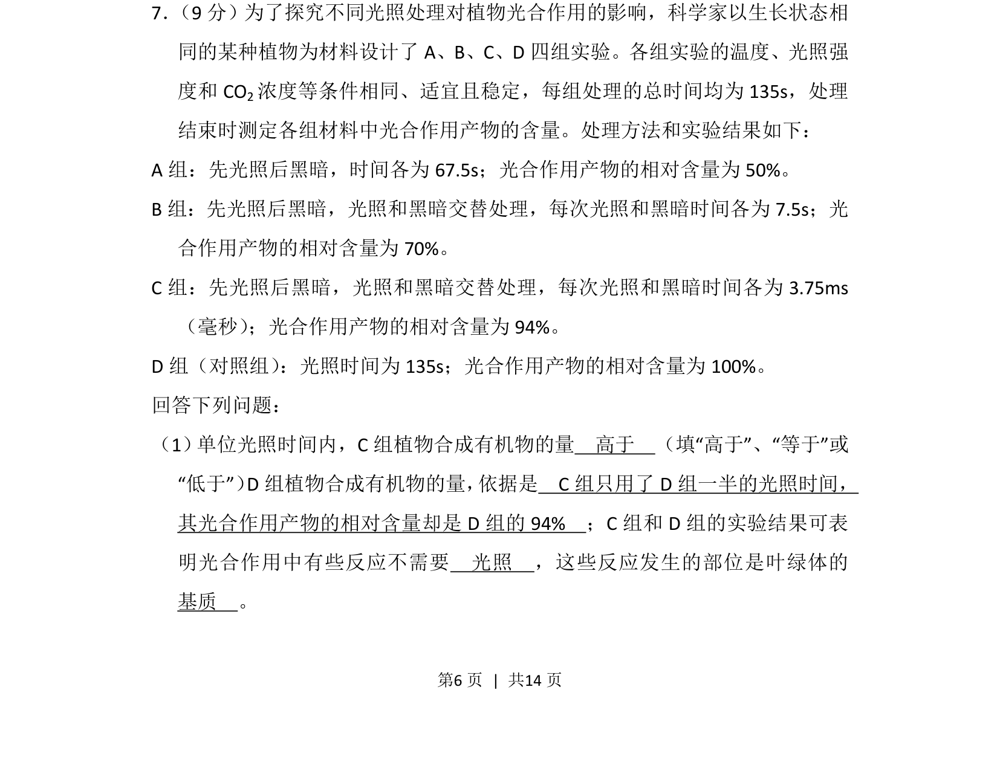
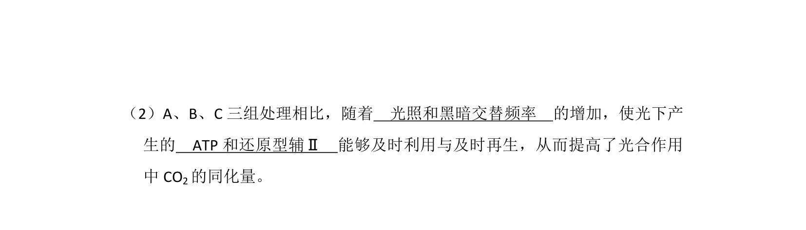
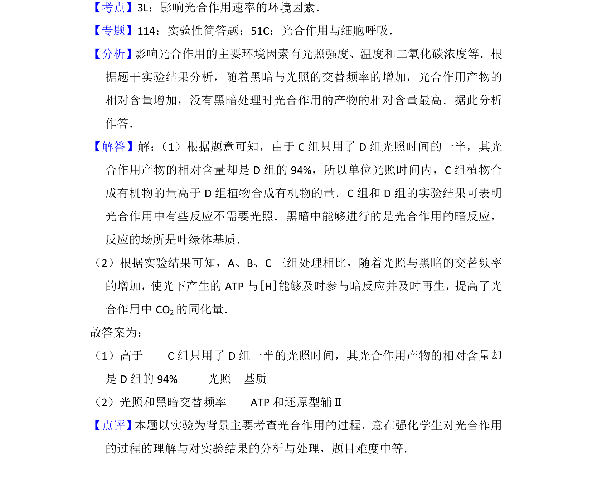

## 题面

## 摘要

探究不同光照交替处理对光合作用产物量的影响，分析光反应与暗反应的关系。

## 关联考点

- [[光合作用的光反应与暗反应]]
- [[光限制]]
- [[叶绿体基质]]
- [[光照时间效率]]

## 答案与解析

> 📄 原 PDF 第 6 页：`素材/真题/湖南/2008-2024·（湖南）生物高考真题/2015年高考生物试卷（新课标Ⅰ）（解析卷）.pdf`
