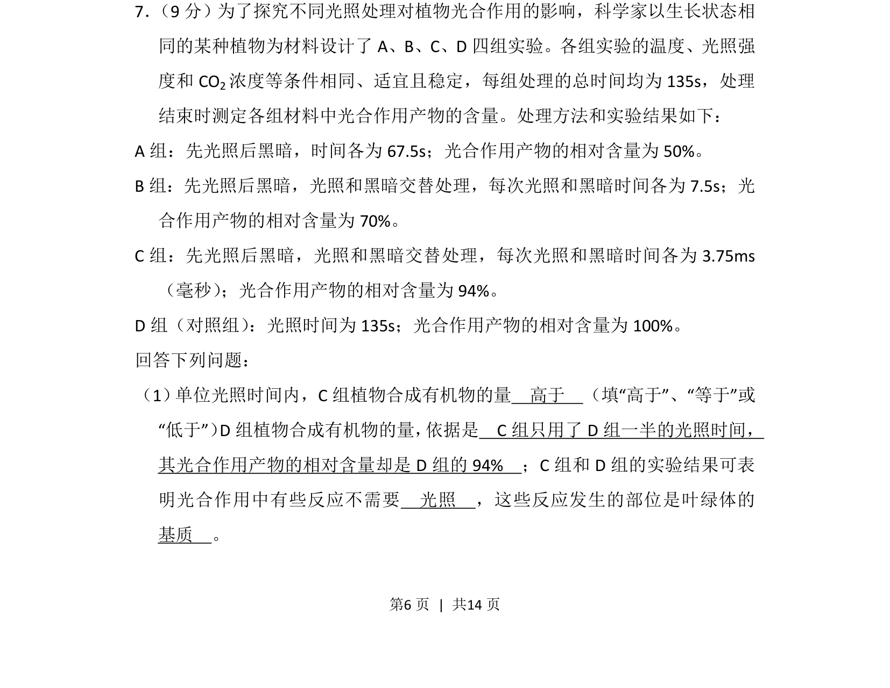
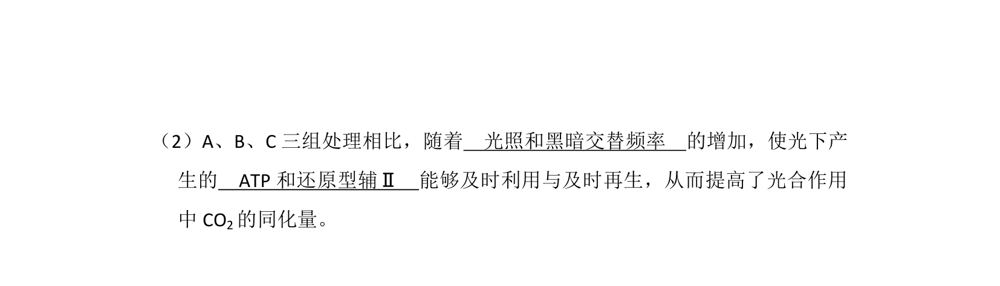
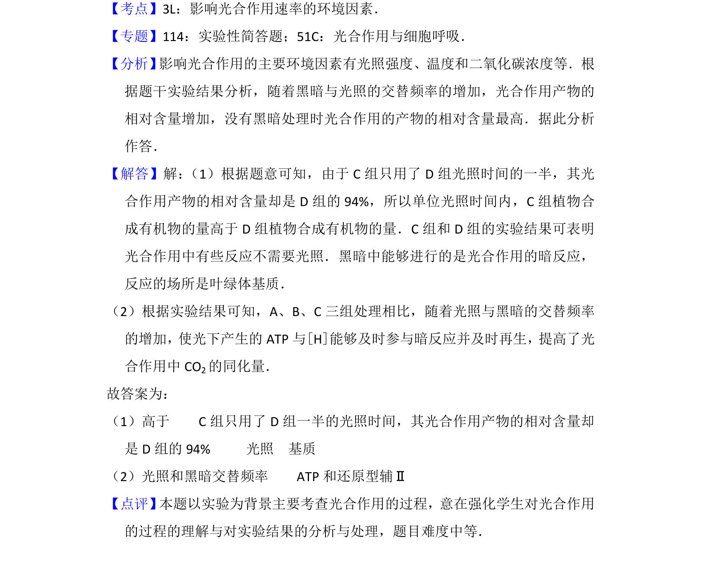

## 题面

## 摘要

探究不同光照交替处理对光合作用产物量的影响，分析光反应与暗反应的关系。

## 关联考点

- [[光合作用的光反应与暗反应]]
- [[光限制]]
- [[叶绿体基质]]
- [[光照时间效率]]

## 答案与解析

> 📄 原 PDF 第 6 页：`素材/真题/湖南/2008-2024·（湖南）生物高考真题/2015年高考生物试卷（新课标Ⅰ）（解析卷）.pdf`

<!-- 题干文本-start -->
## 题干文本
7． （9分）为了探究不同光照处理对植物光合作用的影响，科学家以生长状态相
同的某种植物为材料设计了A、B、C、D四组实验。各组实验的温度、光照强
度和CO 2浓度等条件相同、适宜且稳定，每组处理的总时间均为135s，处理
结束时测定各组材料中光合作用产物的含量。处理方法和实验结果如下：
A组：先光照后黑暗，时间各为67.5s；光合作用产物的相对含量为50%。
B组：先光照后黑暗，光照和黑暗交替处理，每次光照和黑暗时间各为7.5s；光
合作用产物的相对含量为70%。
C组：先光照后黑暗，光照和黑暗交替处理，每次光照和黑暗时间各为3.75ms
（毫秒） ；光合作用产物的相对含量为94%。
D组（对照组） ：光照时间为135s；光合作用产物的相对含量为100%。
回答下列问题：
（1） 单位光照时间内，C组植物合成有机物的量　高于　（填“高于”、“等于”或
“低于”）D组植物合成有机物的量， 依据是　C组只用了D组一半的光照时间，
其光合作用产物的相对含量却是D组的94%　；C组和D组的实验结果可表
明光合作用中有些反应不需要　光照　，这些反应发生的部位是叶绿体的　
基质　。
<!-- 题干文本-end -->

<!-- 解析文本-start -->
## 解析文本

<!-- 解析文本-end -->
