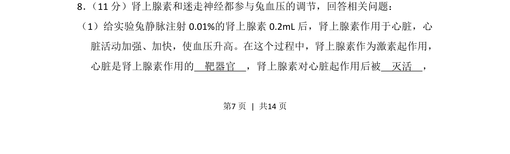
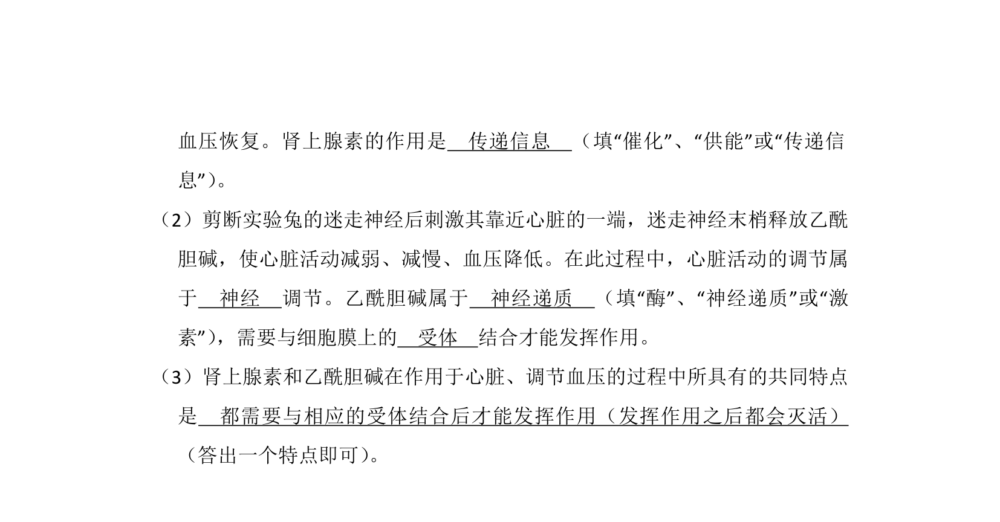
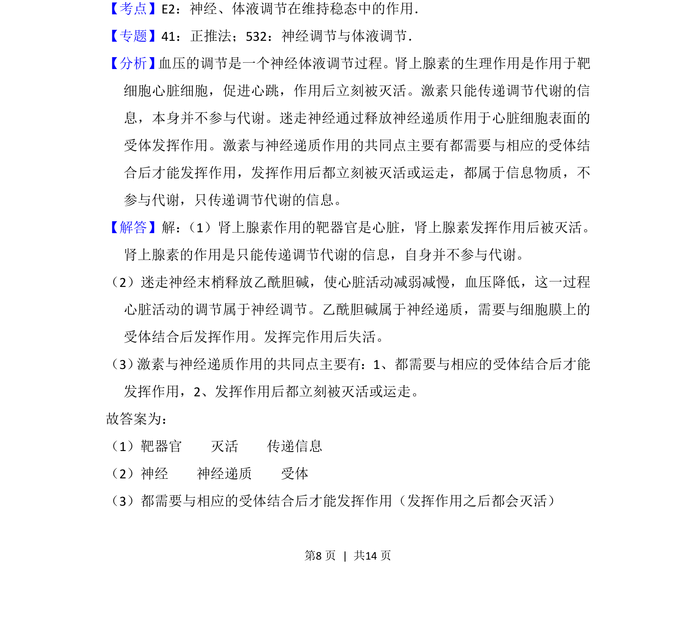
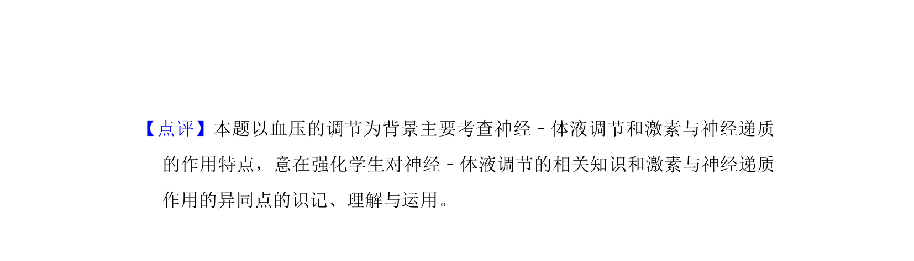

## 题面

## 摘要

肾上腺素通过作为激素作用于心脏靶器官调节血压，作用后被灭活。

## 关联考点

- [[331-激素调节|激素调节]]
- [[靶器官]]
- [[339-肾上腺素|肾上腺素]]
- [[血压调节]]

## 答案与解析

> 📄 原 PDF 第 7 页：`素材/真题/湖南/2008-2024·（湖南）生物高考真题/2015年高考生物试卷（新课标Ⅰ）（解析卷）.pdf`
