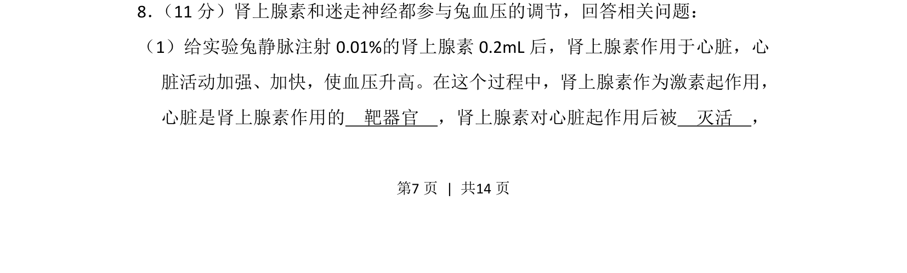
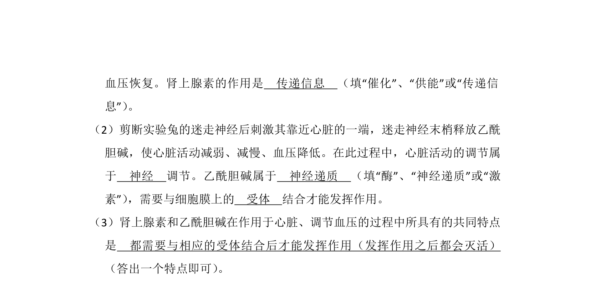
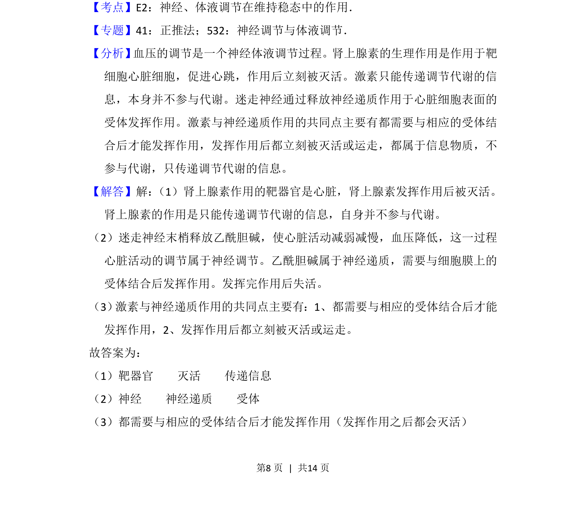
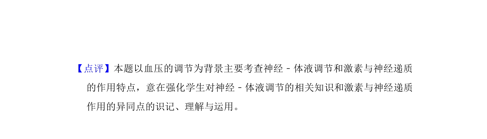

## 题面

## 摘要

肾上腺素通过作为激素作用于心脏靶器官调节血压，作用后被灭活。

## 关联考点

- [[331-激素调节|激素调节]]
- [[靶器官]]
- [[339-肾上腺素|肾上腺素]]
- [[血压调节]]

## 答案与解析

> 📄 原 PDF 第 7 页：`素材/真题/湖南/2008-2024·（湖南）生物高考真题/2015年高考生物试卷（新课标Ⅰ）（解析卷）.pdf`

<!-- 题干文本-start -->
## 题干文本
8． （11分）肾上腺素和迷走神经都参与兔血压的调节，回答相关问题：
（1）给实验兔静脉注射0.01%的肾上腺素0.2mL后，肾上腺素作用于心脏，心
脏活动加强、加快，使血压升高。在这个过程中，肾上腺素作为激素起作用，
心脏是肾上腺素作用的　靶器官　，肾上腺素对心脏起作用后被　灭活　，
<!-- 题干文本-end -->

<!-- 解析文本-start -->
## 解析文本

<!-- 解析文本-end -->
