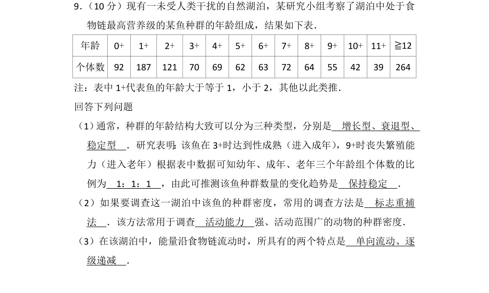
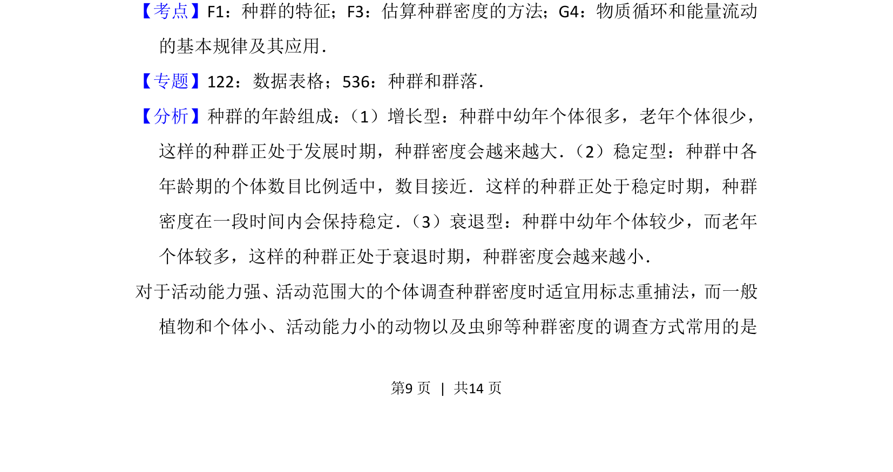
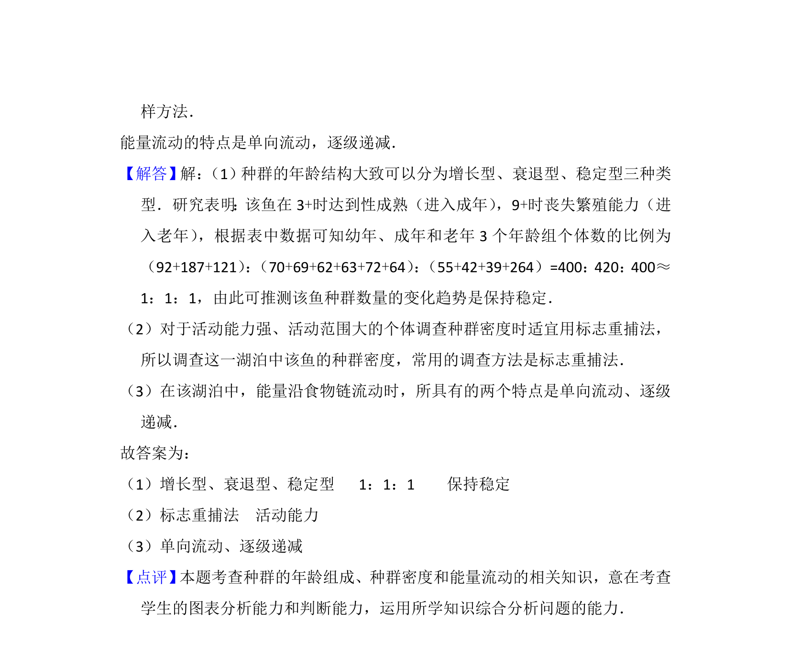

## 题面

## 摘要

该题考查种群年龄组成类型判断、种群密度调查方法（标志重捕法）及能量流动特点。

## 关联考点

- [[862-种群的特征|种群的特征]]
- [[估算种群密度的方法]]
- [[能量流动的基本规律]]

## 答案与解析

> 📄 原 PDF 第 9 页：`素材/真题/湖南/2008-2024·（湖南）生物高考真题/2015年高考生物试卷（新课标Ⅰ）（解析卷）.pdf`
