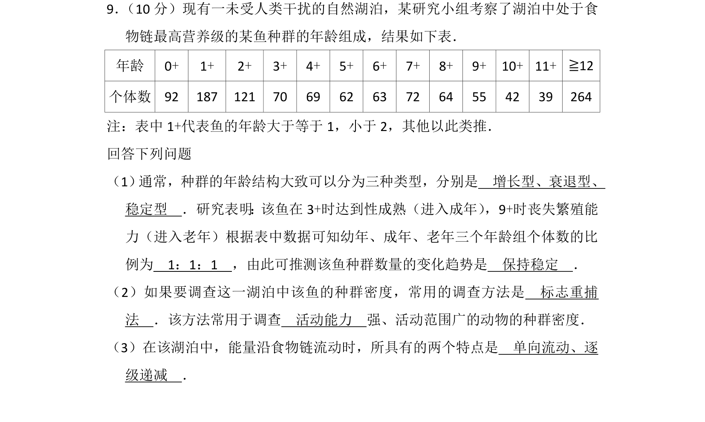
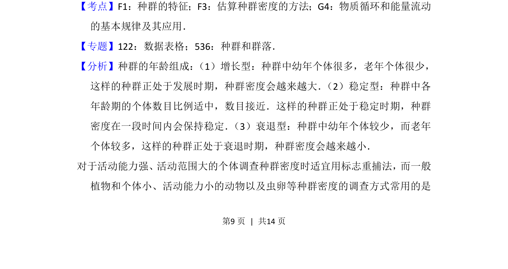
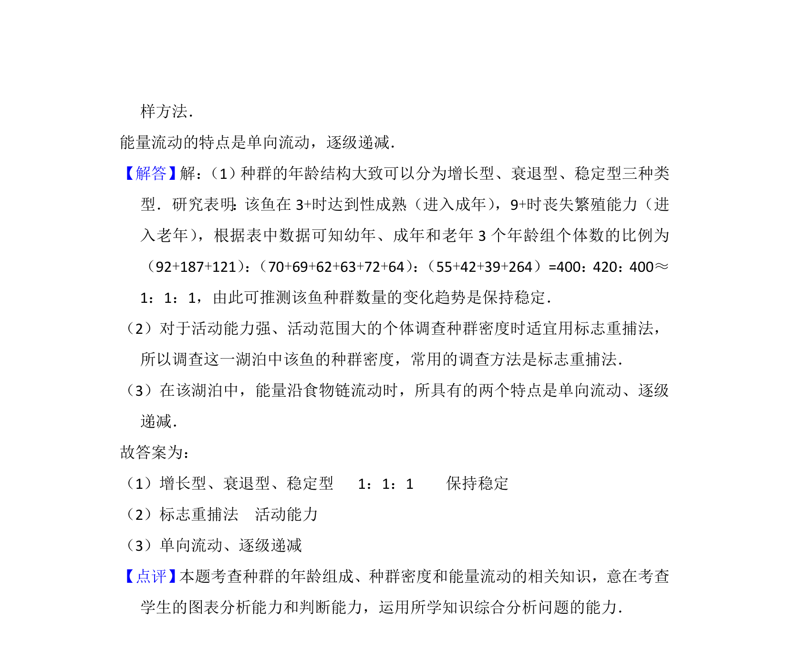

## 题面

## 摘要

该题考查种群年龄组成类型判断、种群密度调查方法（标志重捕法）及能量流动特点。

## 关联考点

- [[862-种群的特征|种群的特征]]
- [[估算种群密度的方法]]
- [[能量流动的基本规律]]

## 答案与解析

> 📄 原 PDF 第 9 页：`素材/真题/湖南/2008-2024·（湖南）生物高考真题/2015年高考生物试卷（新课标Ⅰ）（解析卷）.pdf`

<!-- 题干文本-start -->
## 题干文本
9． （10分）现有一未受人类干扰的自然湖泊，某研究小组考察了湖泊中处于食
物链最高营养级的某鱼种群的年龄组成，结果如下表．
年龄 0+ 1+ 2+ 3+ 4+ 5+ 6+ 7+ 8+ 9+ 10+ 11+ ≧12
个体数 92 187 121 70 69 62 63 72 64 55 42 39 264
注：表中1+代表鱼的年龄大于等于1，小于2，其他以此类推．
回答下列问题
（1） 通常，种群的年龄结构大致可以分为三种类型，分别是　增长型、衰退型、
稳定型　．研究表明：该鱼在3+时达到性成熟（进入成年） ，9+时丧失繁殖能
力（进入老年）根据表中数据可知幼年、成年、老年三个年龄组个体数的比
例为　1：1：1　，由此可推测该鱼种群数量的变化趋势是　保持稳定　．
（2）如果要调查这一湖泊中该鱼的种群密度，常用的调查方法是　标志重捕
法　．该方法常用于调查　活动能力　强、活动范围广的动物的种群密度．
（3）在该湖泊中，能量沿食物链流动时，所具有的两个特点是　单向流动、逐
级递减　．
<!-- 题干文本-end -->

<!-- 解析文本-start -->
## 解析文本
【考点】F1：种群的特征；F3：估算种群密度的方法；G4：物质循环和能量流动
的基本规律及其应用．菁优网版权所有
【专题】122：数据表格；536：种群和群落．
【分析】种群的年龄组成： （1）增长型：种群中幼年个体很多，老年个体很少，
这样的种群正处于发展时期，种群密度会越来越大． （2）稳定型：种群中各
年龄期的个体数目比例适中，数目接近．这样的种群正处于稳定时期，种群
密度在一段时间内会保持稳定． （3）衰退型：种群中幼年个体较少，而老年
个体较多，这样的种群正处于衰退时期，种群密度会越来越小．
对于活动能力强、活动范围大的个体调查种群密度时适宜用标志重捕法，而一般
植物和个体小、活动能力小的动物以及虫卵等种群密度的调查方式常用的是
<!-- 解析文本-end -->
